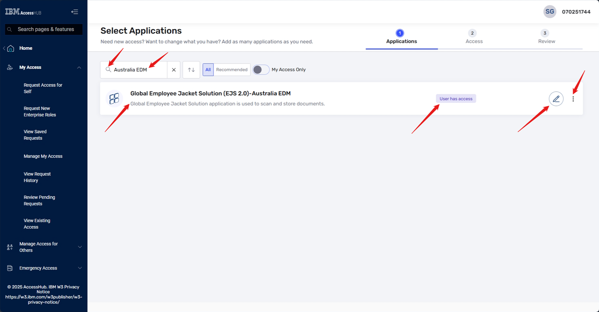

## Requesting Delete/Modify Access in Access Hub

To request delete or modify access to the **Global Employee Jacket Solution (EJS 2.0)–Australia EDM** application, follow these steps:

**Step 1: Login to Access Hub**
Navigate to the [Access Hub](https://ibm-support.saviyntcloud.com/ECMv6/request/requestHome) URL and login to the system.

**Step 2: Navigate to Manage My Access**
Click on **Home** -> **My Access** -> **Manage My Access** from the available options on the left navigator.

**Step 3: Search for Application**
In the search bar, type "Australia EDM" and click the search icon. From the search results, locate "Global Employee Jacket Solution (EJS 2.0)-Australia EDM".

**Step 5: Delete/Modify Access**
On the page, you will have two options:
* **Remove Account**: This option will completely remove your access to the application.

* **Modify Access**: This option will allow you to modify your existing access, such as adding or removing roles.

**Step 6: Choose Option**
Choose the option that best fits your needs:
* If you want to completely remove your access, select **Remove Account**.

* If you want to modify your existing access, select **Modify Access** and make the necessary changes.

**Step 7: Provide Justification**
Provide justification for your request in the comments text area, add attachments if any, and click the checkbox against **I confirm that I have reviewed this request and that I need this access to do my job**.
For Remove/Delete Access:

For Modify Access:

**Step 8: Submit Request**
Click the **Submit Request** button.

**What happens next:**
Your request will be sent to your people manager for approval. If you requested to remove your account, the access will be deleted once your manager approves the request. If you requested to modify your access, the changes will be made once your manager approves and then the second level approver approves the request.

Note: By following these steps, you can either completely remove your access to the application or modify your existing access to better fit your needs.