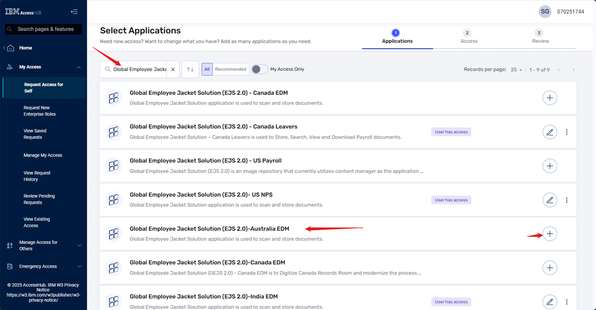

## Access Hub – Requesting New Access

To request new access to the **Global Employee Jacket Solution (EJS 2.0)–Australia EDM** application, follow these steps:

1. To request access in the <u>UAT environment</u>, navigate to the [Access Hub - UAT](https://ibm-preprod-support.saviyntcloud.com/ECMv6/request/requestHome) URL and log in using your W3 ID.

2. To request access in the <u>Production environment</u>, navigate to the [Access Hub](https://ibm-support.saviyntcloud.com/ECMv6/request/requestHome) URL and log in using your W3 ID.

**Note:** For <u>UAT environment</u> requests, the submission request will not auto-trigger an email to the approver. You will need to contact the approver and provide the request link to obtain approval.

- To request access in the Production environment, navigate to the [Access Hub](https://ibm-support.saviyntcloud.com/ECMv6/request/requestHome) URL and log in using your W3 ID.

- Once logged in, the homepage will load.   
   
- Click on the Home -> My Access -> Request Access for Self from the available options on the left navigator. On the right side of the page, 'Select Applications' page will be displayed. 
      
- In the search bar, type "Global Employee Jacket Solution" and click the search icon. From the search results, locate "Global Employee Jacket Solution (EJS 2.0)-Australia EDM" and click on '+' icon which is next to it that shows "Add to access request" on mouse over (Note that if the user has access to it already, the text ‘User has access’ will be displayed next to it. In such case user is not allowed to place new request, instead the user can edit existing roles with same instructions and submit). Click on the 'Next' button which is at the right bottom corner of the page.
   
   
- Then 'Select Access' page will be displayed, On that page add Global EJS Australia EDM Roles appropriately from the 'Available Entitlements' to 'Selected Entitlements' by clicking on select (+) icon for each role. Then review the added roles and click on the 'Next' button which is at the right bottom corner of the page.
      
- Now the 'Review and Justification' page will appear, on that page add justification for requesting the role(s) if required, provide helpful clarification or context for your request in comments text area, add attachments if any by drag and drop or using browse option. 
   
   
- Click the checkbox against 'I confirm that I have reviewed this request and that I need this access to do my job.' Review the details and click on 'Submit Request' button which is at the right bottom corner of the page. 
   	
- Verify the access once the request approved and Modify your Access when required.
   

## Access Hub - Approval Process

- **First-Level Approval: People Manager**

   Manager Review: The request is automatically routed to the requester’s designated people manager within IBM Access Hub.

   Approval Criteria: The manager assesses the request based on business needs, role justification, and compliance with organizational policies.

   Decision: The manager can approve, deny, or request additional information from the requester.

- **Second-Level Approval: Additional Reviewer**

   Additional Review: After first-level approval done, it is routed to a second-level reviewer. Second-level approval list provided below.

   Approval Criteria: This level assesses the request for compliance with security policies, potential risks, and broader organizational impact.

   Decision: The secondary approver makes the final decision to approve or deny the request.

   Approver Name | e-mail ID |
   -- | -- |
   Shiela Phan | shiela.phan@ph.ibm.com |