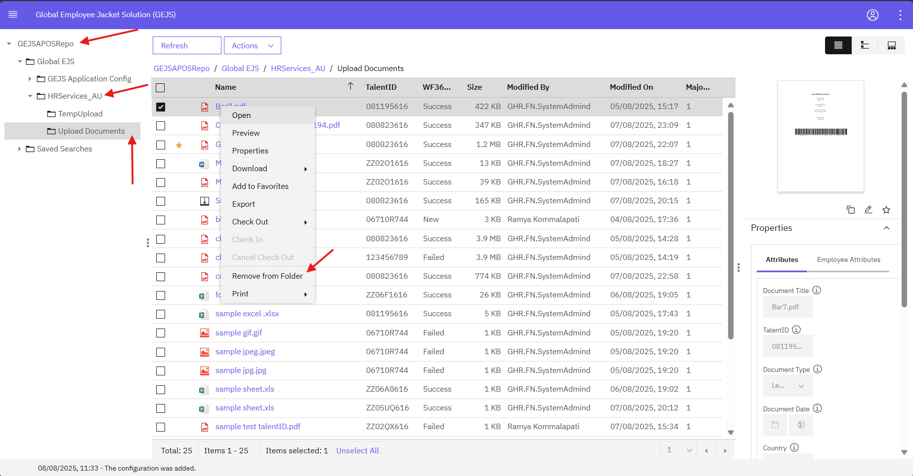
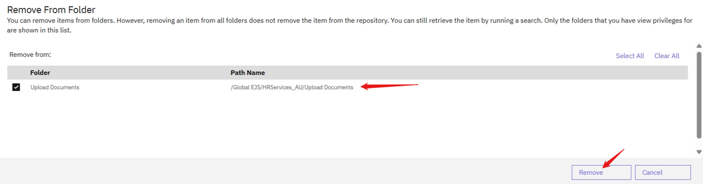

### Removing Documents from a Folder
To remove documents from a folder, follow these steps:

**Step 1: Navigate to the Folder**
Navigate to the folder by referring to the [Browse Folders](https://pages.github.ibm.com/Global-EJS/GEJS-Australia-EDM-User-Manual/docs/Actions/Browse.html) section.

**Step 2: Access the Upload Documents Subfolder**
Click on the subfolder **Upload Documents** based on your user access.

**Step 3: Select Documents**
Select the single or multiple documents that you want to remove from the folder.

**Step 4: Open Menu**
Right-click on the selected document(s), and a menu will be displayed.

**Step 5: Remove from Folder**
Click on the **Remove from Folders** option.

**Step 6: Confirm Removal**
A confirmation window will be displayed, allowing you to choose the subfolders from which you want to remove the document.

**Step 7: Complete Removal**
Once you confirm the removal, the document will be removed from the selected folder(s) and will still be available in the repository for search.

**What happens next:**
When you remove a document from a folder, it will no longer be visible in that folder, but it will not be deleted from the system. The document will still be available in the repository and can be searched for and accessed.

**Note:** Removing a document from a folder does not delete the document from the repository. It only removes the document from the folder's view. If you want to delete a document permanently, you will need to use the **Delete** option instead.

By following these steps, you can remove documents from a folder and manage your folder structure more efficiently.