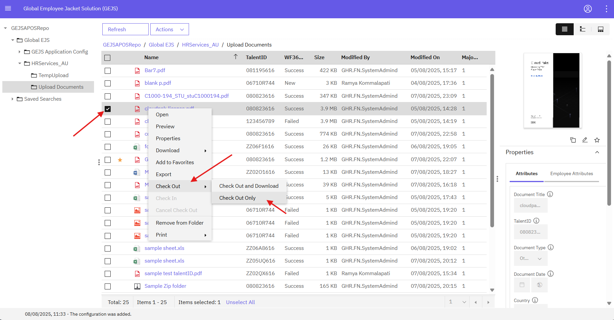
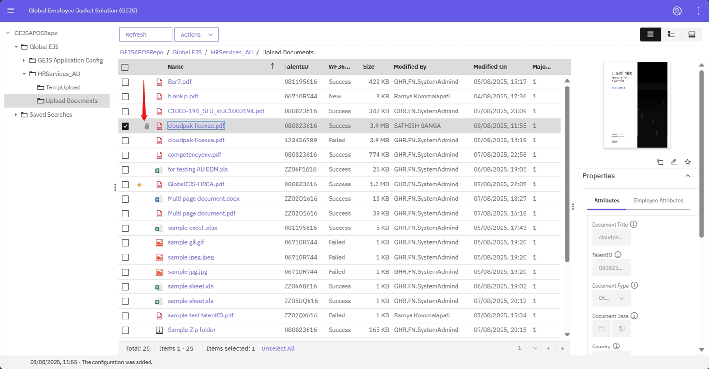

### Check In Document

To check-in a document and replace an existing one, follow these steps:

1. Navigate to the Folder
    - Go to the [Browse Folders](https://pages.github.ibm.com/Global-EJS/GEJS-Australia-EDM-User-Manual/docs/Actions/Browse.html) section and click on the Upload Documents subfolder.

2. Select the Document
    - View all documents inside the selected folder and right-click on the document that is checked-out, identified by a lock icon next to its title. If there is no document, select one and Check Out.
    
    

3. Initiate Check-In
    - Select Check In from the context menu.
    

4. Upload the New Document
    - In the Check In page, select the new document from your local drive. A file selector dialogue box will open, allowing you to choose the file you want to check-in. After selecting the file, click Open.

5. Complete Check-In
    - Click on the Check In Button to upload the document to the respective folder or repository. The existing document in the repository will be replaced with the latest document selected from your local drive.

By following these steps, you can successfully check-in a new document and replace the existing one in the repository.