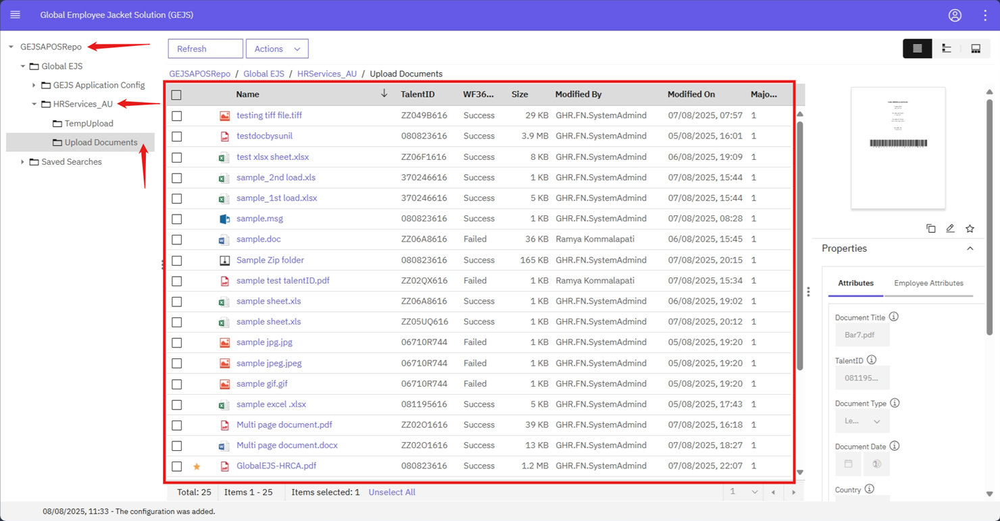
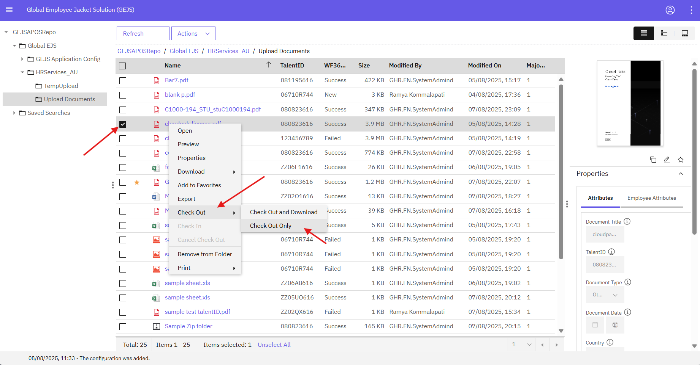
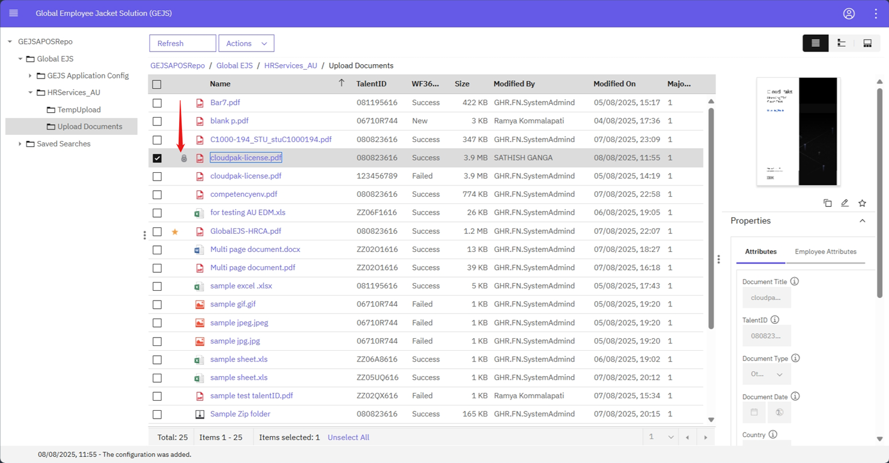

### Checking Out a Document

The Check Out option allows you to lock a document, preventing other users from opening or viewing its content and attributes. Here's how to check out a document:

1. Navigate to the Folder
    - Go to the  [Browse Folders](https://pages.github.ibm.com/Global-EJS/GEJS-Australia-EDM-User-Manual/docs/Actions/Browse.html) section and click on the Upload Document subfolder.

2. Select the Document
    - View all documents inside the selected folder and right-click on the document you want to check out. A menu will be displayed.
    

3. Check Out the Document
    - Click on Check Out from the menu. You will have two options.
        - *Check Out Only*: This option is used for editing the document content as well as its properties. The document will be locked by the current user and will not be available to other users.
        - *Check Out and Download*: This option is also used for editing the document content and properties, and it will download the document to your local drive. The document will be locked by the current user and will not be available to other users.
    

4. Confirm Check Out
    - Once you click on Check Out, the document will be locked, and you will see a lock icon next to the document title, indicating that it is checked out by you.
    

By checking out a document, you ensure that you have exclusive access to edit its content and properties, preventing any conflicts or simultaneous modifications by other users.