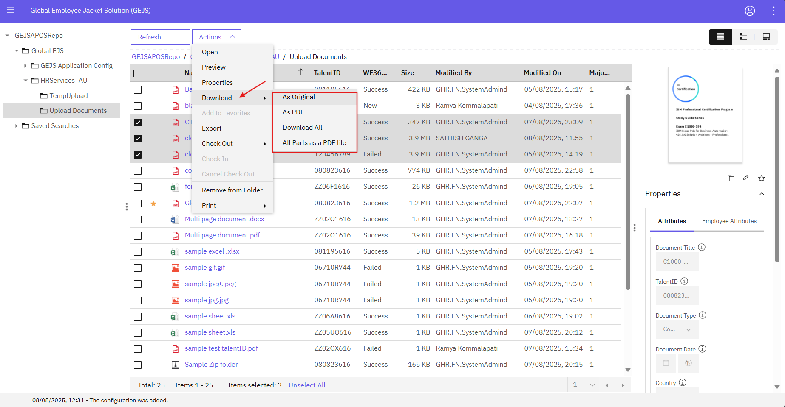
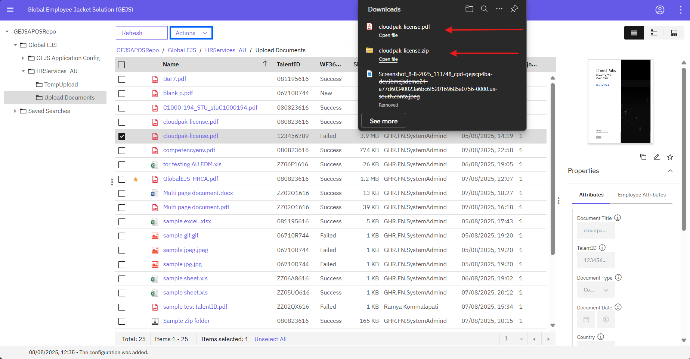

### Downloading a Document

To download a document, follow these steps:

1. Navigate to the Document
   - Navigate to the document via the [Search](https://pages.github.ibm.com/Global-EJS/GEJS-Australia-EDM-User-Manual/docs/DocumentSearch/DocumentSearch.html) function or by expanding the Global_EJS folder to HRServices_AU folder and its sub-folder.

2. Access the Document
   - Users can view documents via Search Results or by selecting the folder, based on their permissions.

3. Download Options
   - Right-click on the document, and a menu will open. Select Download to view the available download options:
      - *As Original*: The document will be downloaded in its original file format.
      - *As PDF*: The original file format of the document will be converted to PDF and then downloaded. Note that some file types may not be converted to PDF.
      - *Download all*: All pages of the document will be downloaded in its original file format.
      - *All parts as a PDF*: All pages of the document will be converted to PDF and then downloaded.
   

4. Select Download Option
   - Click on any of the available options to download the document.
   

Important Note: When using the As PDF download option, the actual document type is converted to PDF format. However, not all document types can be converted to PDF, and an error may occur. If an error occurs, it is normal behavior, and the user can opt for another download option.

By following these steps, users can download documents in various formats, depending on their needs and the document's original file type.