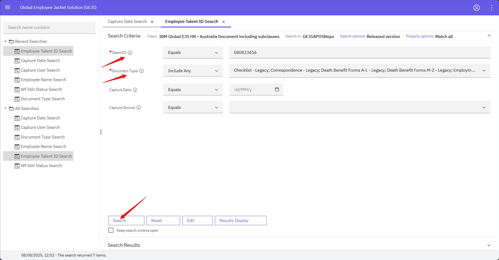
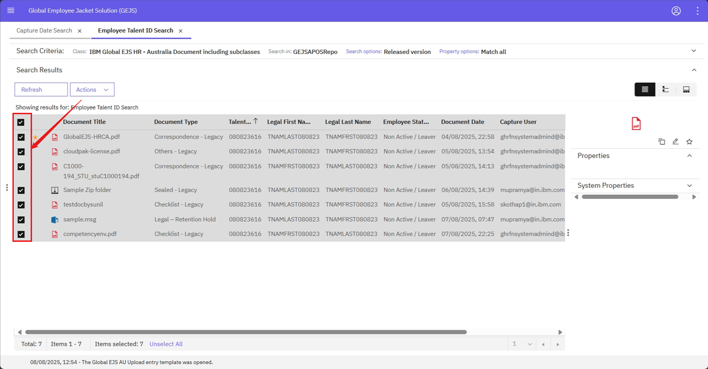
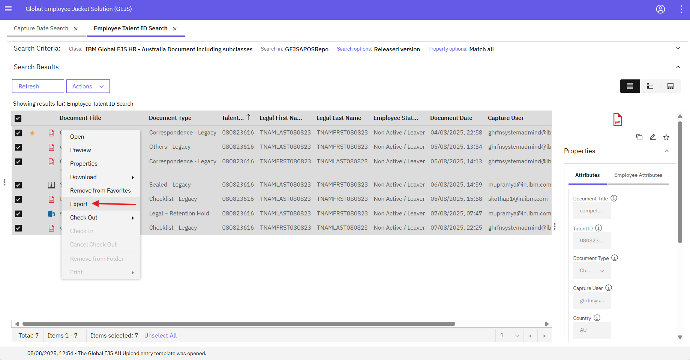
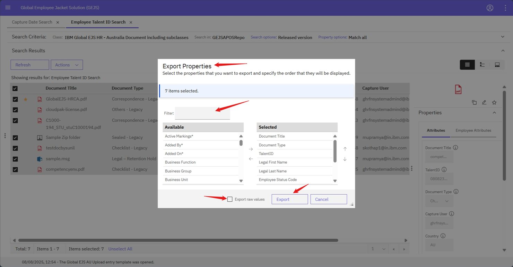
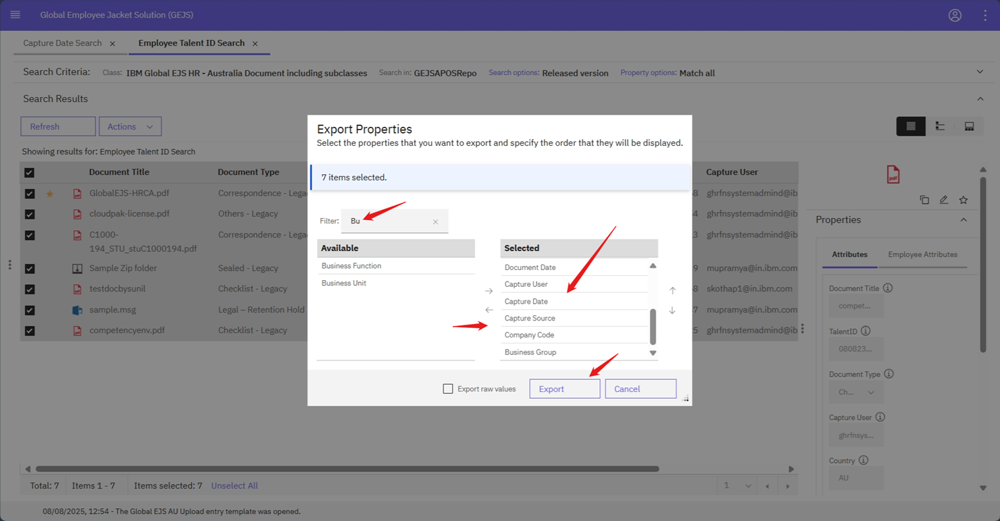
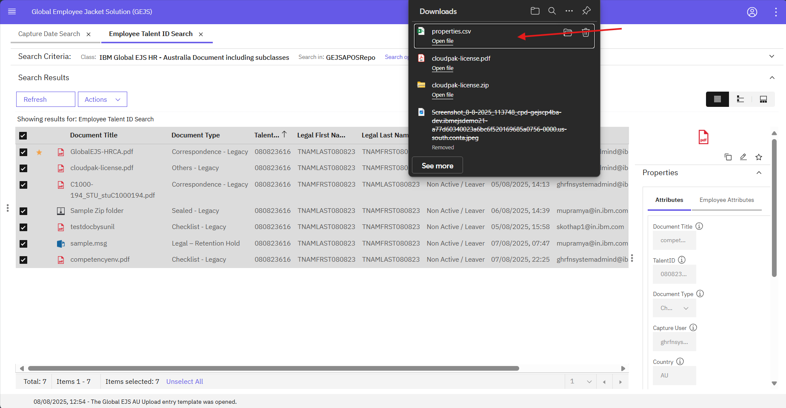
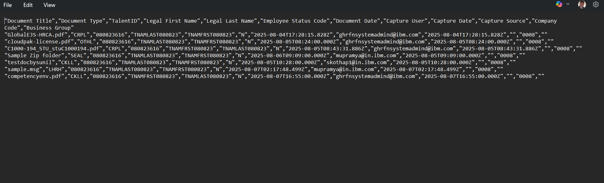

### Exporting Document Properties Report

To export a document properties report, follow these steps:

1. Navigate to the Document
  - Navigate to the document via the [Search](https://pages.github.ibm.com/Global-EJS/GEJS-Australia-EDM-User-Manual/docs/DocumentSearch/DocumentSearch.html) function or by selecting the appropriate folder, depending on your user permissions.
  

2. Select Documents
  - Select the documents for which you want to generate reports by checking the boxes on the left side. You can choose one document or multiple documents as needed.
  

3. Access Export Option
  - Right-click on the selected document(s) to bring up a context menu and choose Export to begin the export process.
  

4. Configure Export Settings
  - In the Export Properties window, select the specific properties and details you want to include in the exported report. You can choose which properties to include or exclude as needed.
  

5. Generate Report
  - After making your selections, click on the Export button to generate and download your report.
  

6. Save Report
  - Provide an appropriate file name and choose the desired location on your system where you want to save the file. Click Save to finalize the process.
  

7. View Report
  - You can view the file by using the View Downloads option in your browser or by navigating directly to the file location on your computer. Open the file to review the detailed information included in your report.

8. Verify Report Contents
  - Verify the properties and values of all the uploaded files. If you selected only one file during the export process, the report will contain a single row corresponding to that file. If multiple files were selected, the report will display the properties and values for all of the documents included in the export.
  

By following these steps, you can export a document properties report that includes the specific information you need, making it easier to manage and analyze your documents.