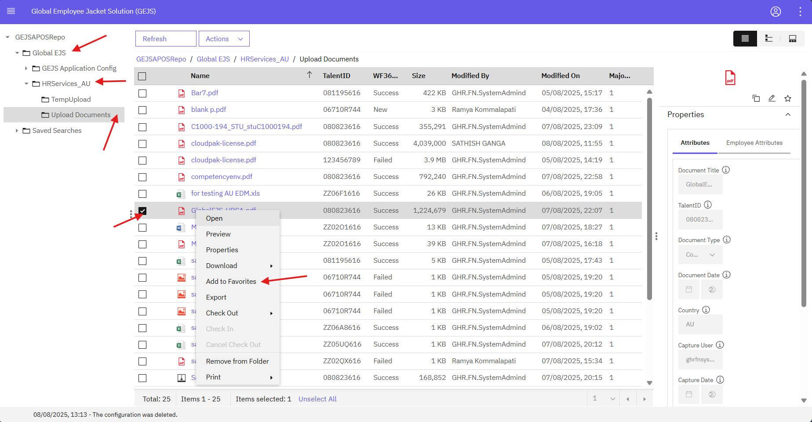
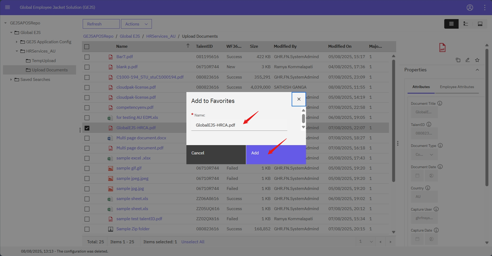
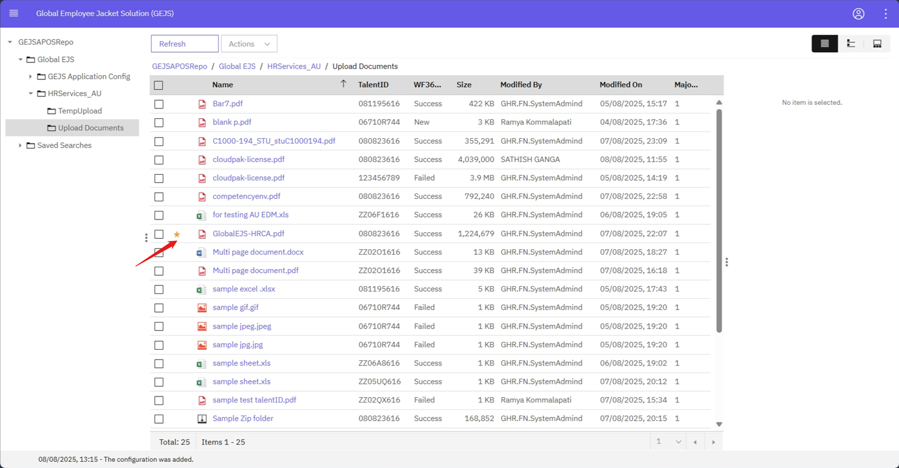
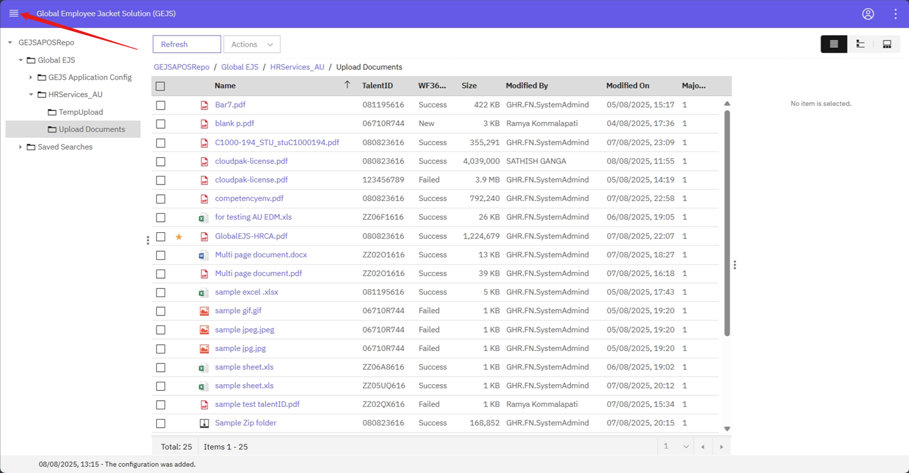
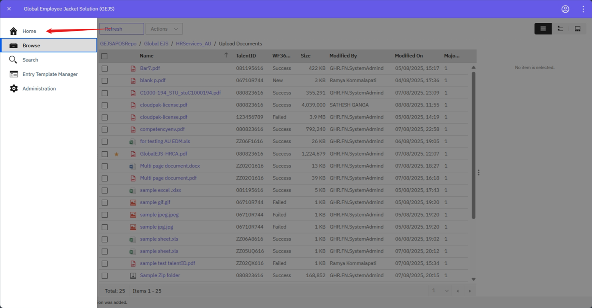
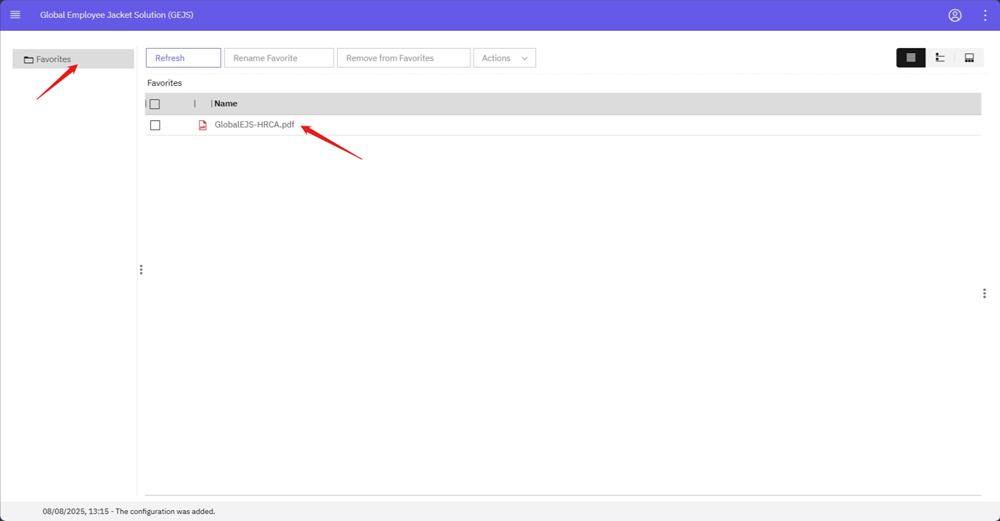

### Adding Documents to Favorites

To add a document to your Favorites, follow these steps:

1. Navigate to the Document
    - Navigate to the document via the [Search](https://pages.github.ibm.com/Global-EJS/GEJS-Australia-EDM-User-Manual/docs/DocumentSearch/DocumentSearch.html) function or by expanding the Global_EJS folder to HRServices_AU folder and its sub-folder.
    
2. Access the Document
    - Users can view documents via Search Results or by selecting the folder, based on their user permissions.

3. Add to Favorites
    - Right-click on the document, and a menu will open. Click on Add to Favorites.
    
    
    

4. Edit Favorites Name (Optional)
    - The Add to Favorites dialog will load, allowing you to edit the name for your favorites if needed. Click on the Add button to add the document to your Favorites.
    

5. Access Favorites Folder
    - To view your favorite documents, click on the four bars at the top-left corner of the screen and then click on Home.
    

6. View Favorites
    - The Favorites folder will be visible, and you can view all the documents that you have added to your Favorites.
    

Note: Folders can also be added to the Favorites menu by right-clicking on the folder and selecting Add to Favorites.

By following these steps, you can easily add documents to your Favorites and access them quickly from the Favorites folder.