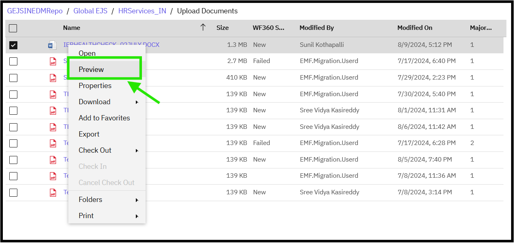
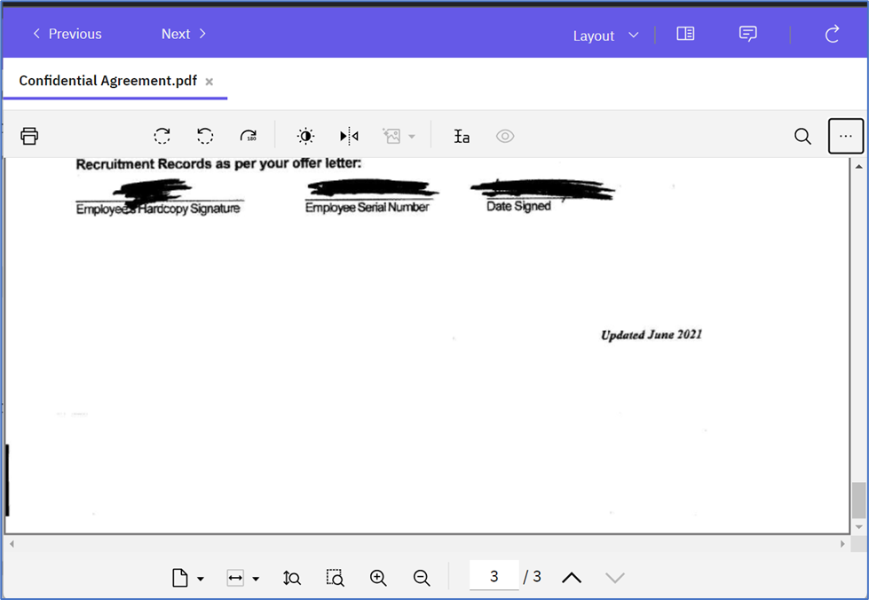
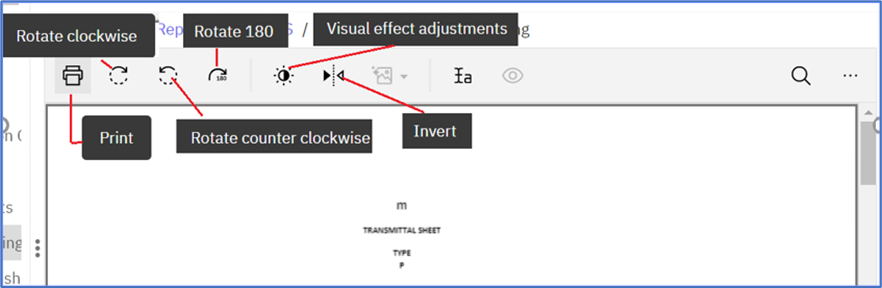

### Previewing a Document (Displays document in system viewer)

To preview a document, follow these steps:

1. Navigate to the Document
   - Navigate to the document via the [Search](https://pages.github.ibm.com/Global-EJS/GEJS-Australia-EDM-User-Manual/docs/DocumentSearch/DocumentSearch.html) function or by expanding the Global_EJS folder to HRServices_AU folder and its sub-folder.

2. Access the Document
   - Users can view documents via Search Results or by selecting the folder, based on their user permissions.

3. Open Preview
   - Right-click on the document, and a menu will open. Click on the Preview action.
   

4. View Document in System Viewer
   - The document will be displayed in the system viewer, allowing you to view its contents.
   

5. Use Available Features
   - You can use the features visible on the UI to navigate and interact with the document, such as zooming, scrolling, and searching.
   

By following these steps, you can quickly preview a document and access its contents without having to download or open it in a separate application.