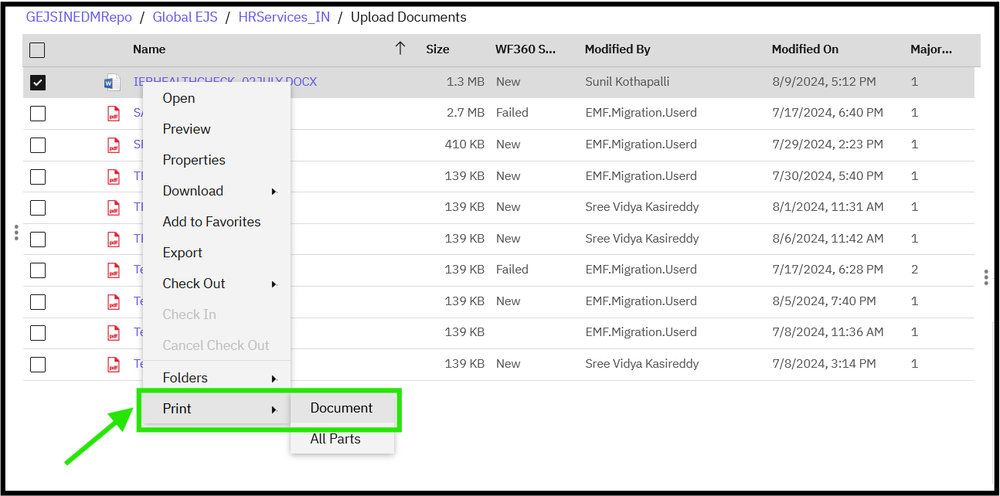
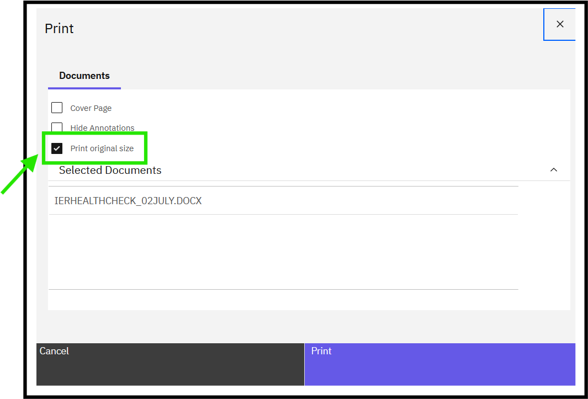
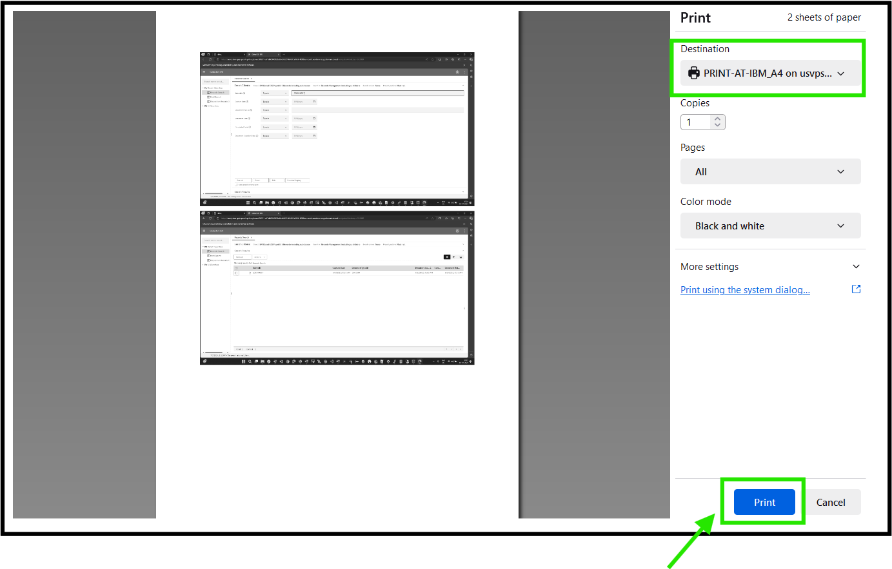
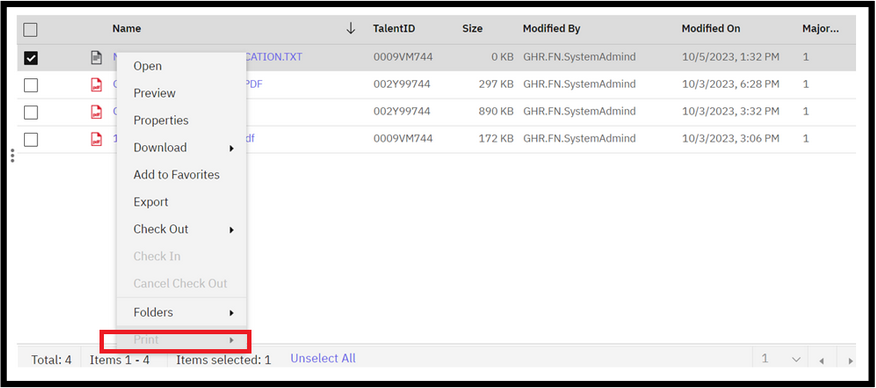

### Printing a Document
To print a document, follow these steps:

1. Navigate to the Document
   - Navigate to the document via the [Search](https://pages.github.ibm.com/Global-EJS/GEJS-Australia-EDM-User-Manual/docs/DocumentSearch/DocumentSearch.html) function or by expanding the Global_EJS folder to HRServices_AU folder and its sub-folder.

2. Access the Document
   - Users can view documents via Search Results or by selecting the folder, based on their user permissions.

3. Open Print Option
   - Right-click on the document, and a menu will open. Click on Print.
   

4. Configure Print Settings
   - A print window will be displayed. Choose the Print Original size checkbox, if it's not already checked.
   

5. Print the Document
   - Click on Print to print the document. Then, click on the Print button to confirm the printing action.
   

Note: The print option for "Txt" files is not enabled due to the following reasons:

The print option is not supported for documents of type "Text" files.
Internet browsers no longer support Java applets due to increased security, which is required to print "Text" files.
If you try to print a "Text" file, you will see a message indicating that the print option is not enabled.

By following these steps, you can print a document, except for "Text" files, which have limited print functionality due to browser security restrictions.