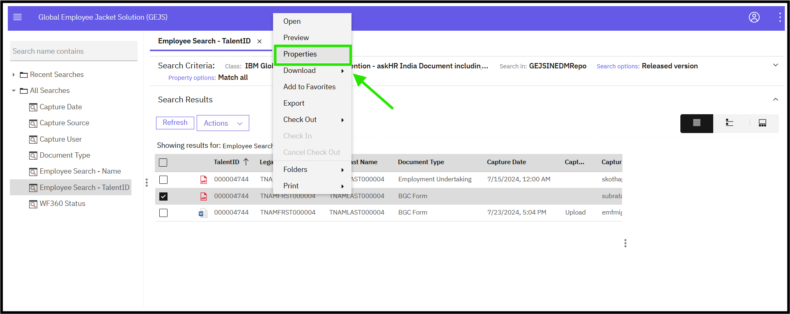
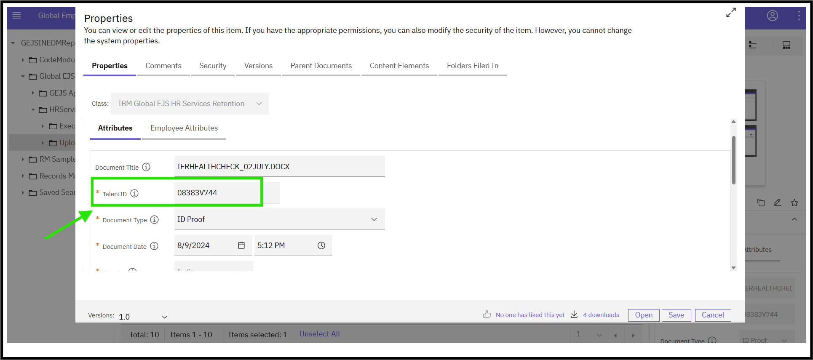

### Viewing Document Attributes/Properties

To view the properties of a document, follow these steps:

1. Navigate to the Document
   - Navigate to the document via the [Search](https://pages.github.ibm.com/Global-EJS/GEJS-Australia-EDM-User-Manual/docs/DocumentSearch/DocumentSearch.html) function or by expanding the Global_EJS folder to HRServices_AU folder and its sub-folders.

2. Access the Document
   - Users can view documents via Search Results or by selecting the folder, based on their user permissions.

3. Open Properties
   - Right-click on the document, and a list of menus will be displayed. Click on Properties.
   

4. View Document Properties
   - The Properties window will open, displaying a list of document properties and their corresponding values on the Properties tab.
   

By following these steps, you can view the properties of a document, which can include metadata such as document title, author, creation date, and more.

Note: The Properties window provides a detailed view of the document's attributes, allowing you to access and review important information about the document.

The Properties tab may display various properties, including but not limited to:

- Document title and description
- Author and creation date
- File type and size
- Version and revision history
- Security and access controls

The specific properties displayed may vary depending on the document type and the system's configuration.