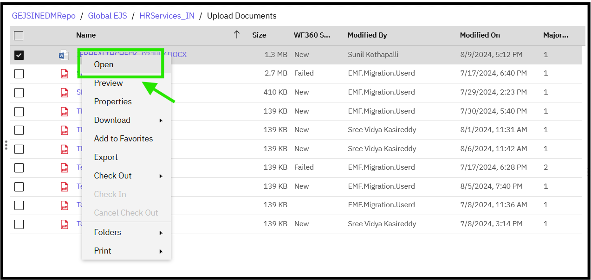
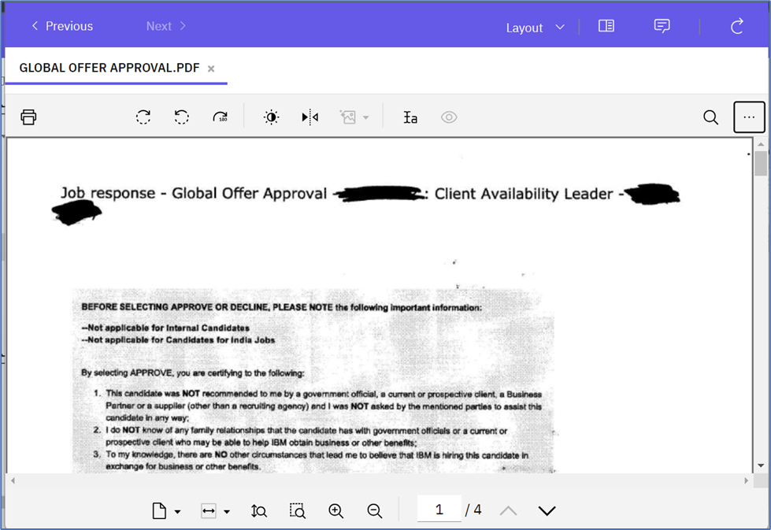
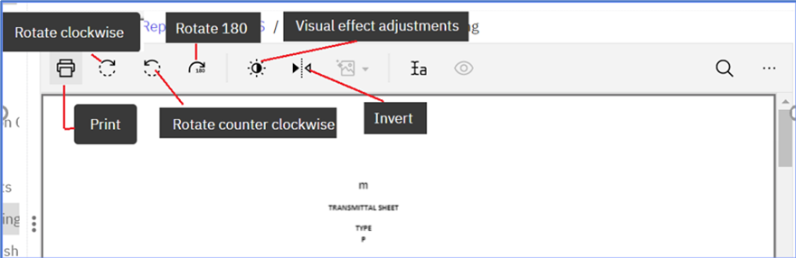

### Opening a Document
To open a document, follow these steps:

1. Navigate to the Document
    - Navigate to the document via the [Search](https://pages.github.ibm.com/Global-EJS/GEJS-Australia-EDM-User-Manual/docs/DocumentSearch/DocumentSearch.html) function or by expanding the Global_EJS folder to HRServices_AU folder and its sub-folders.

2. Access the Document
    - Users can view documents via Search Results or by selecting the folder, based on their user permissions.

3. Open the Document
    - Right-click on the document, and a menu will open. Click on Open.
    

4. Document Loading
    - If the document belongs to a valid type, such as PDF or TIFF, it will be loaded in the document viewer. Otherwise, the document will be opened in the application installed on the user's machine, such as Microsoft Excel or Microsoft Word.
    

5. Interact with the Document
    -Once the document is opened, you can use the features visible on the UI to interact with the document, such as zooming, scrolling, and searching.
    

Note: The document will be opened in the most suitable application or viewer based on its file type, allowing you to view and interact with the document's contents.

The document viewer may provide various features, including but not limited to:

- Zooming and panning
- Searching and highlighting
- Navigation and bookmarking
- Printing and downloading

The specific features available may vary depending on the document type and the system's configuration.