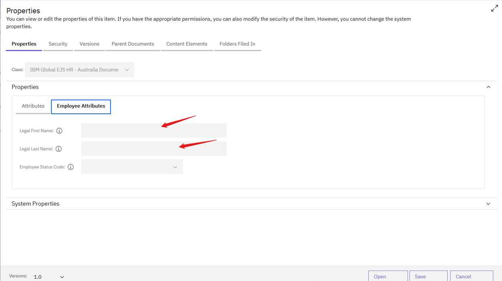

### Auto-Population of FirstName and LastName Properties

The system has the ability to auto-populate the FirstName and LastName property values for existing documents based on a valid TalentID value.

* How it Works:
   - When a valid TalentID value is entered, the system will automatically populate the Legal First Name and Legal Last Name property values in the Employee Attributes tab.
   - The auto-population of these values is based on a WF360 API call, which verifies the validity of the TalentID value.
   - If the TalentID value is valid, the corresponding Legal First Name and Legal Last Name values will be populated.

* Examples:

*Valid TalentID*: If the entered TalentID value is 080823616, the Legal First Name and Legal Last Name values will be auto-populated because the entered TalentID value is valid.

*Invalid TalentID*: If the entered TalentID value is TESTCM897, the Legal First Name and Legal Last Name values will not be populated because the entered TalentID value is invalid.

By auto-populating the FirstName and LastName properties, the system streamlines the data entry process and reduces the risk of errors, ensuring that employee attributes are accurate and up-to-date.