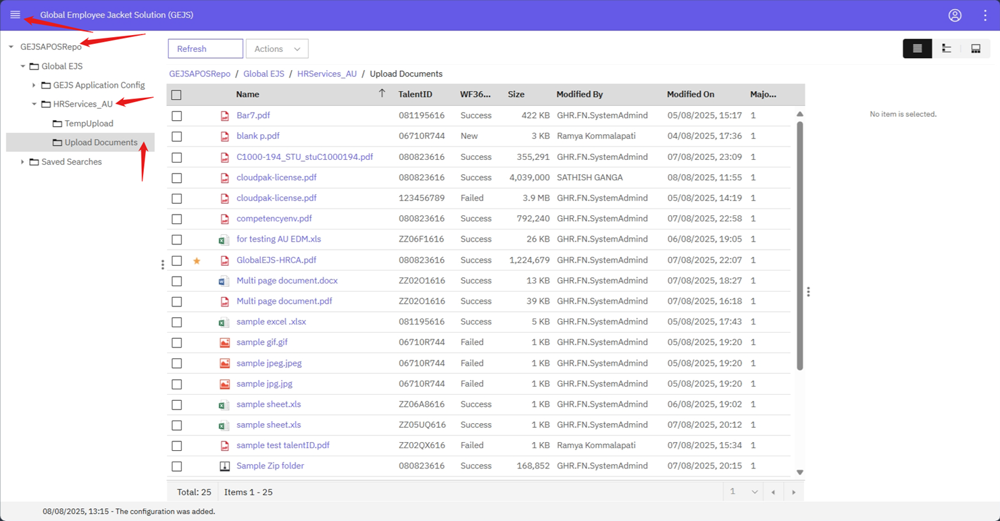

### Edit Documents from "Upload Documents" folder

Please follow the below instructions to edit document from the Offboarding folder.

- For Login information, refer to [User Login](https://pages.github.ibm.com/Global-EJS/GEJS-Australia-EDM-User-Manual/docs/UserLogin.html) section.

- From the Browse page, expand the Global EJS folder, now the HRServices_AU  folder will be visible.

- Expand the HRServices_AU folder and open "Upload Documents" folder.

    

- Right click on required document and then click on Properties.
    
    

- On the properties screen that is displayed, user can edit the properties such as TalentID, Document Type, Document Title, Document date and clauses , if applicable.