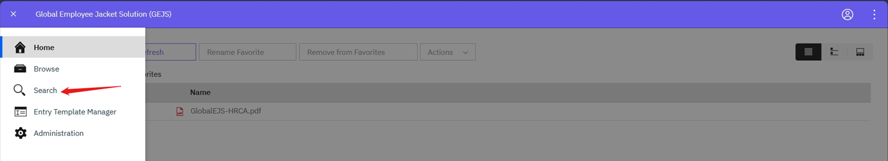
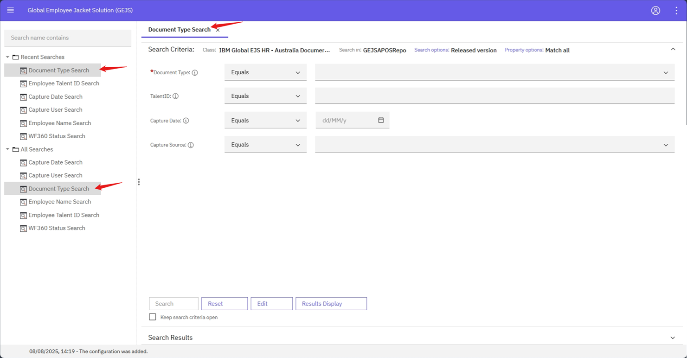
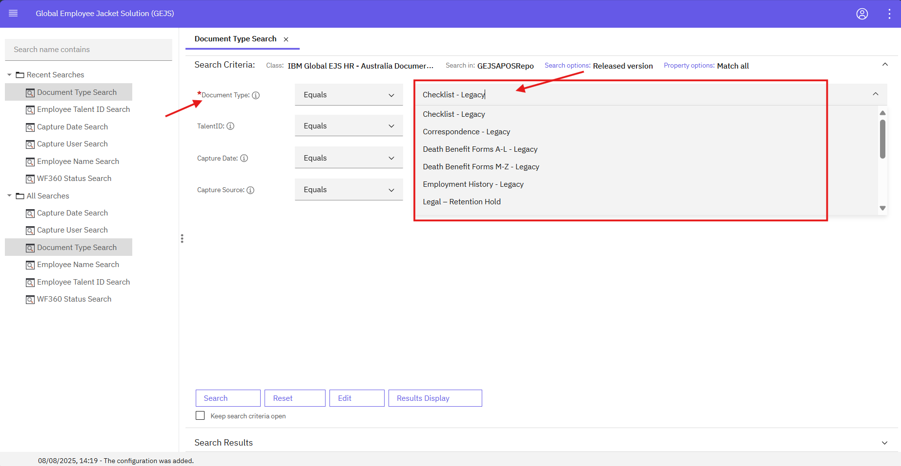
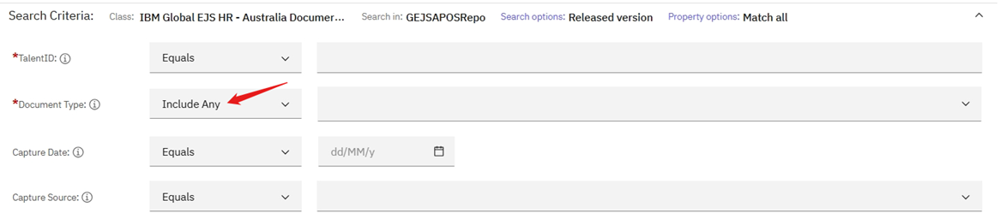
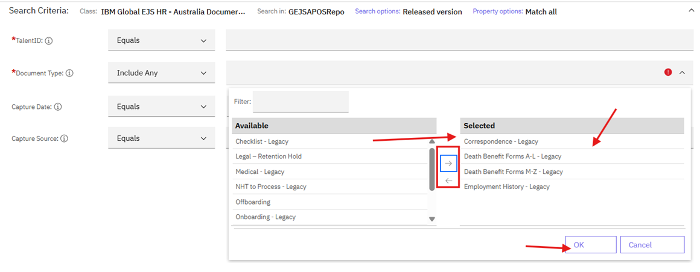
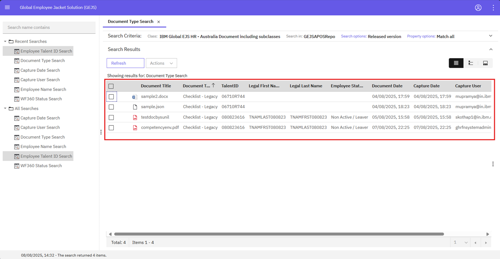
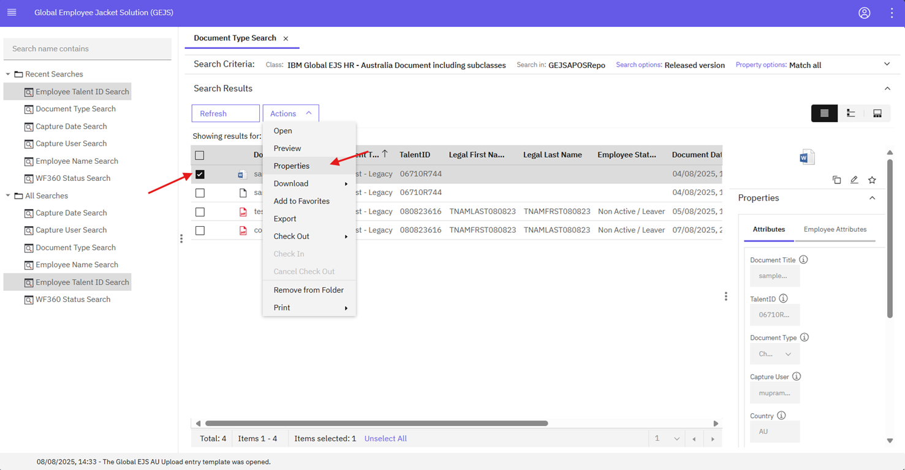
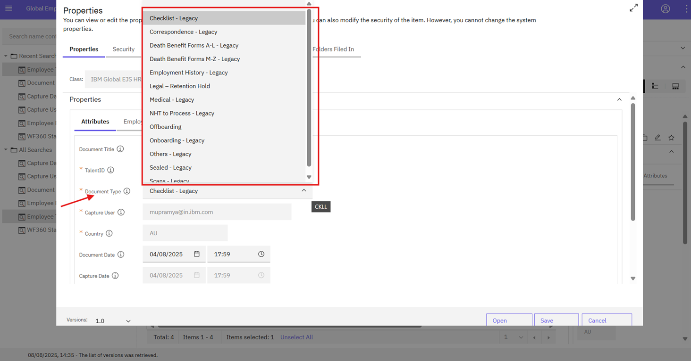

### Editing Document Type from the Search Screen

To edit the document type from the search screen, follow these steps:

1. Navigate to the Search Page
    - Click on Search, and in the Search page, expand the All-searches folder to view the list of search templates.
    

2. Select Document Type
    - Click on Document Type and in the search panel, select the document type of the document for which you want to edit the properties.
    
    

3. Select Multiple Document Types (Optional)
    - If needed, you can select multiple document types by choosing the Includes Any operator, which allows retrieving documents that match any of the selected document types as part of the search criteria.
    
    

4. Select Search Template
    - To select a search template, refer to the [Document Search](https://pages.github.ibm.com/Global-EJS/GEJS-Australia-EDM-User-Manual/docs/DocumentSearch/DocumentSearch.html) page for detailed information.

5. Run the Search
    - Click on the Search button, and the corresponding documents will be displayed on the search results section.
    

6. Access Document Properties
    - Right-click on any of the documents and then click on Properties.
    

7. Edit Document Properties
    - On the properties window that is displayed, edit the following fields as needed:
        - Document Type
        - Talent ID
        - Document Title
        - Document Date etc.
    

8. Save Changes
    - Click on the Save button to save the changes.

By following these steps, you can edit the document type and other properties of a document from the search screen.