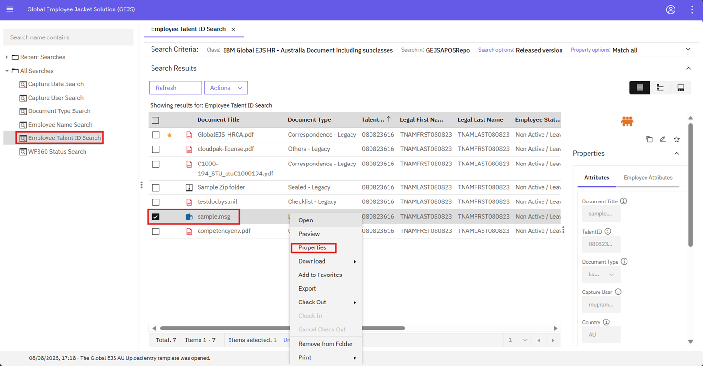

### Editing Talent ID from the Search Screen

To edit the Talent ID from the search screen, follow these steps:

1. Login and Access the Browse Page
    - Refer to the [User Login](https://pages.github.ibm.com/Global-EJS/GEJS-Australia-EDM-User-Manual/docs/UserLogin.html) page for login information. From the Browse page, click the hamburger icon to expand the menu.
    

2. Navigate to the Search Page
    - Click on Search, and in the Search page, expand the All-searches folder to view the list of search templates.
    

3. Select Search Template
    - Click on Employee Search – Talent ID and type in the Talent ID of the document for which you want to edit the properties.
    

4. Run the Search
    - To select a search template, refer to the Document Search page for detailed information.
    

5. Access Document Properties
    - Right-click on any of the documents and then click on Properties.
    

6. Edit Talent ID
    - On the properties window that is displayed, edit the Talent ID field as needed. You can also edit other fields such as:
        - Document Type
        - Document Title
        - Document Date etc.
    

7. Save Changes
    - Click on the Save button to save the changes.
    

By following these steps, you can edit the Talent ID and other properties of a document from the search screen.

Note: Make sure to have the necessary permissions and access rights to edit documents. Additionally, be cautious when editing document properties to ensure that the changes are accurate and authorized.