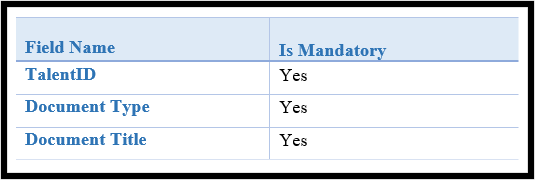
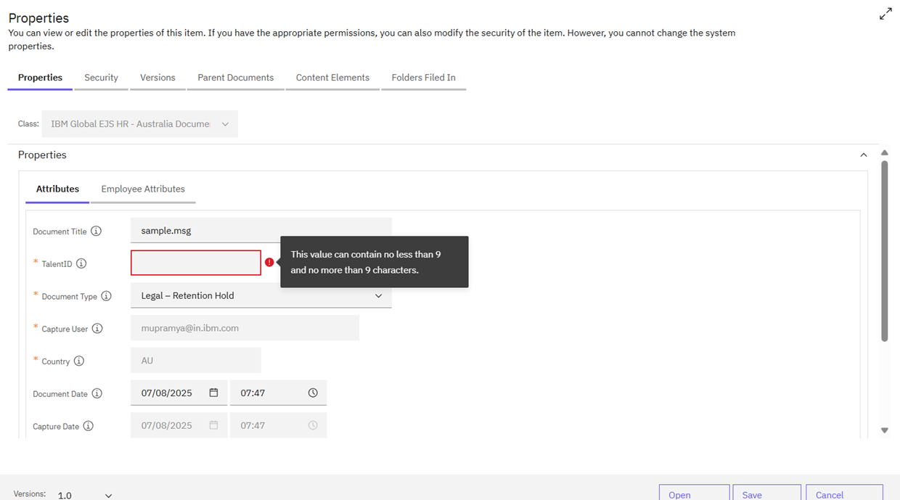
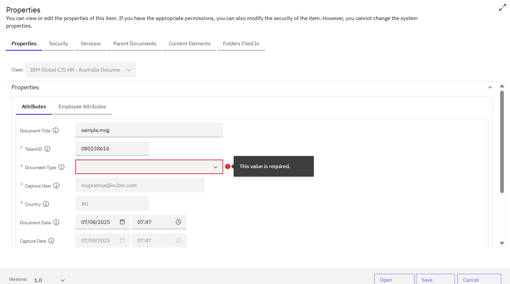

### Mandatory Fields and Validations

When editing document properties, certain fields are mandatory and must be filled in. These fields are marked with a red star symbol.

* Mandatory Fields:
    - Mandatory editable fields cannot be empty. If a mandatory field is left empty, an error message "This value is required" will be displayed.
    - The following fields are mandatory and require user input when uploading documents manually:
    

* Field Validations:
    - Each property has its own set of validation rules. For example, the Document Type ID field requires a valid value to be selected.
    - If a mandatory field is empty or invalid, an error message will be displayed, and the user will not be able to save the changes.
    - Refer to the [Validations](https://pages.github.ibm.com/Global-EJS/GEJS-Australia-EDM-User-Manual/docs/DocumentImport/CommonFunctionalities/Validations.html) page for more details on the specific validation rules for each property.

    

    

By ensuring that all mandatory fields are filled in and valid, users can successfully edit document properties and upload documents to the system.