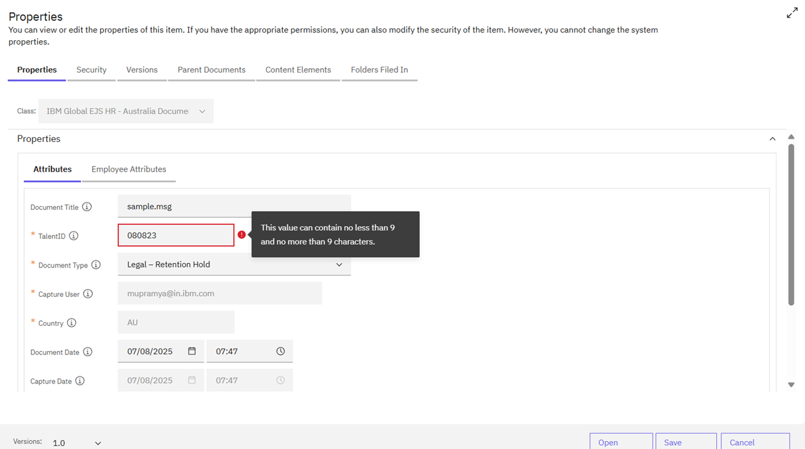
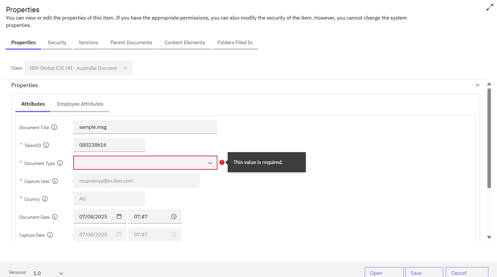

User should follow validations for every field while providing values when uploading documents to repository or folders.  Please follow below instructions while providing values.

# Validations
{: .no_toc }

## Table of contents
{: .no_toc .text-delta }

1. TOC
{:toc}

---

**Validation Rules**
The system has specific validation rules to ensure that user input is accurate and consistent. The following validation rules apply:

### TalentID Validation
1. Length: The TalentID field must contain exactly 9 characters.
2. Format: The TalentID field must be alphanumeric, meaning it must contain a combination of both alphabets and numbers.
3. Error Message: If the user enters less than 9 or more than 9 characters, an error popup will be displayed against the TalentID field, as shown below:

### Document Type Validation
1. Dropdown Values: The Document Type field must be selected from the available dropdown values.
2. Required Field: The Document Type field cannot be empty.
3. Error Message: If the Document Type field is empty, a "The value is required" error message will be displayed, as shown below:
The image couldn't be loaded(data:image/png;base64,assets/images/v2.png)

By adhering to these validation rules, users can ensure that their input is valid and consistent, and avoid errors when editing document properties.