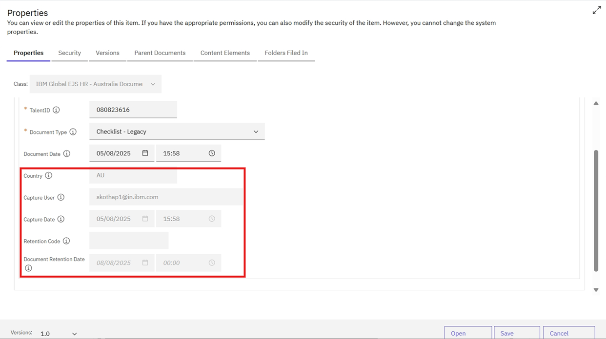
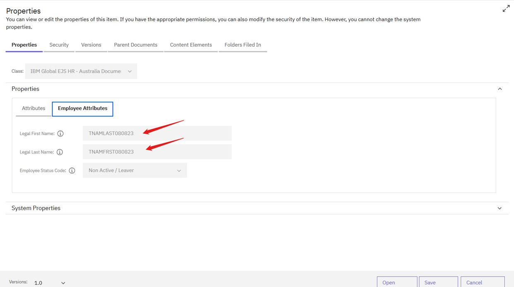
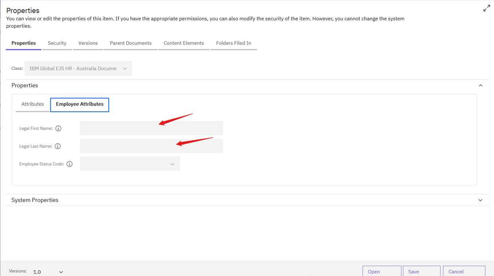

## Auto populate fields

## Table of contents
{: .no_toc .text-delta }

1. TOC
{:toc}

---
### Auto populate field details
- Details of auto populate fields at the time of adding documents

| Property to Enter | Mandatory | Drop Down (Choice list) | Property Length | Auto Populate |
| --- | --- | --- | --- | --- |
| TalentID | Yes | No | 10 | No |
| Document Type | Yes | Yes | 50 | No |
| Document Date | Yes |  |  | Yes |
| Country | Yes |  | 3 | Yes |
| Capture User | Yes |  | 250 | Yes |
| Capture Date | No |  |  | Yes |

### Capture User
- In the “Attributes” tab of Add Document Template, **Capture User** field value is pre-populated with logged in user id & will be read-only.    

### Capture Date
- In the “Attributes” tab of Add Document Template, **Capture Date** field value is pre-populated with current datetime and will be read-only.
   
### Document Date
- In the “Attributes” tab of Add Document Template, **Document Date** field value is pre-populated.
   
### Country
- In the “Attributes” tab of Add Document Template, **Country** field value is pre-populated with Canada & will be read-only. 
    
    
   
### Employee attributes via WF360 API call
- If the entered talent ID is valid, then attributes like Legal last name, first name, separation date, employee type, status and executive flag are populated via WF360 API call as soon as the document is uploaded into the repository.
    

- If the entered talent ID is invalid, then the WF360 API call will fail, and all the above-mentioned fields will be blank for the document.
    

