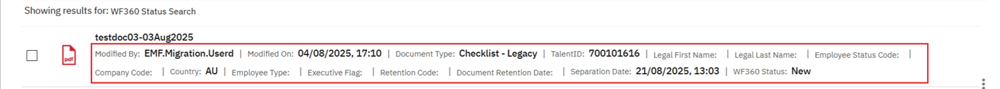
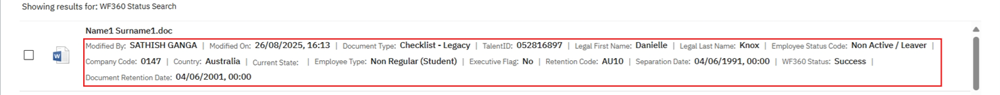
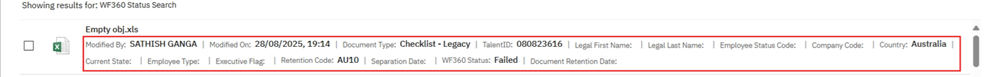

## Workforce 360 (WF360)

Workforce 360 (WF360) is an IBM enterprise solution designed to manage people data. It is a comprehensive platform that provides a single, unified view of employee data, enabling organizations to make informed decisions and improve workforce management. WF360 provides a centralized repository for employee data, including personal, job, and organizational information. The platform ensures data accuracy, completeness, and consistency, with robust governance and validation rules. WF360 ensures the security and confidentiality of employee data, with robust access controls and compliance with regulatory requirements.

## Table of contents
{: .no_toc .text-delta }

1. TOC
{:toc}

### Integration with Australia EDM Application

In the Australia EDM application, employee data, such as First Name, Last Name, Employee Type, Separation Date, Employment Status and Code, Company and Country codes, and Executive Flag, are retrieved from WF360 based on the given employee Talent ID. This integration enables the Australia EDM application to access and utilize the employee data stored in WF360, providing a seamless and connected experience for users. The retrieved data is used to populate various fields in the Australia EDM application, such as employee attributes and document metadata.

### WF360 API Call

If the entered Talent ID is valid, attributes such as Legal Last Name, First Name, Separation Date, Employee Type, Status, and Executive Flag are populated via WF360 API call as soon as the document is uploaded into the repository. If the entered Talent ID is invalid, the WF360 API call will fail, and all the above-mentioned fields will be blank for the document. The WF360 API call is a critical component of the integration between WF360 and the Australia EDM application, enabling the exchange of employee data between the two systems.

### WF360 Status Update

When a valid Talent ID is entered, it may take a few minutes for the employee data to be updated. During this time, the WF360 status will be displayed as 'New'. Once the data is fetched, the status will be updated to either 'Success' or 'Failure', depending on the validity of the Talent ID. The WF360 status update is an important aspect of the integration, as it provides a clear indication of the status of the employee data retrieval process.

### Update of Incorrect Talent ID

If a user enters an incorrect or invalid Talent ID while uploading a document and later corrects it after realizing the mistake, the updated WF360 status and corresponding employee data for the corrected Talent ID will not be reflected immediately. There is a scheduled job that runs every 24 hours to update such cases. As a result, the updated status and employee data will only be reflected after the job has run. This means that users may need to wait for up to 24 hours for the corrected data to be reflected in the system. It is essential for users to ensure that the correct Talent ID is entered initially to avoid delays in the update process.

### Document Retention Date Calculation

WF360 data plays a crucial role in calculating the retention date for certain document types. For documents that are specified to be considered for retention based on separation date, WF360 provides the necessary data to determine the retention date. The separation date, which is retrieved from WF360, is used to calculate the retention date, and the system takes necessary action when the date approaches. This automated process ensures that documents are retained for the required period and are disposed of or archived in a timely manner. The use of WF360 data in document retention date calculation helps organizations to comply with regulatory requirements and maintain accurate records. By leveraging WF360 data, organizations can ensure that their document retention policies are enforced consistently and efficiently, reducing the risk of non-compliance and associated penalties.