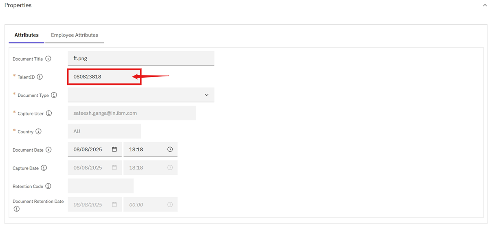
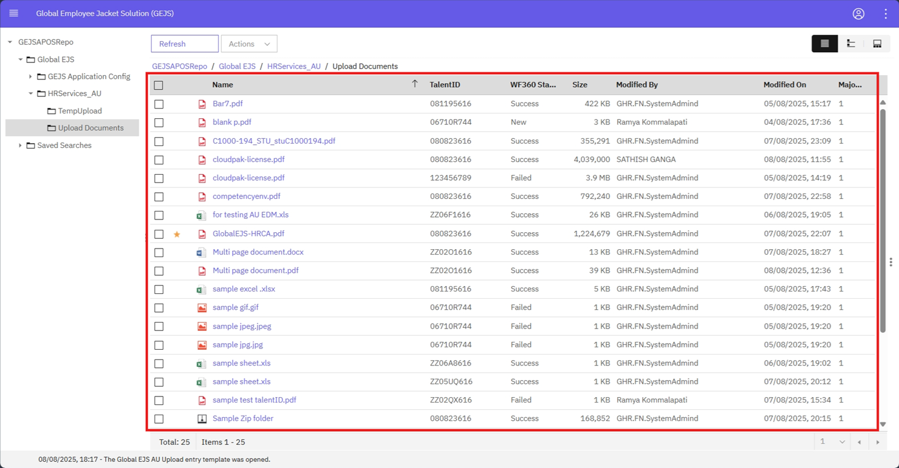

### Uploading Documents
To upload documents into the system, you can use either the "Add Document" button or the drag and drop feature. Here are the steps to follow:

**Step 1: Login to the Application**
Login into the Global EJS Australia EDM application. Refer to the [User Login](https://pages.github.ibm.com/Global-EJS/GEJS-Australia-EDM-User-Manual/docs/UserLogin.html) section for more login details.

**Step 2: Navigate to the Browse Page**
Refer [Browse Folder](https://pages.github.ibm.com/Global-EJS/GEJS-Australia-EDM-User-Manual/docs/Actions/Browse.html), land on the Browse page and look for "Upload Documents" Folder. Click on the "Upload Documents" Folder.

**Step 3: Select the Document**
Open the document location on your local machine, select the document(s) for upload to the repository.

**Method 1: Drag and Drop**

* Select and drag the document(s) and drop it on the Browse page into the "Upload Documents" Folder.
* Once dropped, the user will see the ‘Add Document’ dialog on the UI (User Interface).

**Method 2: Add Document Button**

* Click on the "Add Document" button to upload document(s). A 'Add Documents' popup window will appear, click on "Choose Files" button. 
* Select the document(s) from your local machine and click "Open" to upload.

**Add Document Dialog**

* Default location of Save in is the repository, and users are not authorized to change the Save in location.
* The **File name** will be auto-populated based on the selected document and will be in read-only mode.
* The Add Document template includes 2 tabs:
	+ Attributes
	+ Employee Attributes

**Attributes Tab**

* In the ‘Attributes’ tab, the following details will need to be provided by the user:
	+ Document Title
	+ TalentID
	+ Document Type
* Document Title is the name of the selected document, and its value will be auto-populated. The user will also be able to change the document title.
* Enter TalentID, Document Type attributes.
   

* Refer to the [Validations](https://pages.github.ibm.com/Global-EJS/GEJS-Australia-EDM-User-Manual/docs/DocumentImport/CommonFunctionalities/Validations.html) section before providing values.
* Country, Capture User, Capture Date, Capture Source will be set by the system.

**Properties Table**

| Property to Enter | Mandatory | Drop Down (Choice list) | Property Length | Auto Populate |
| --- | --- | --- | --- | --- |
| TalentID | Yes | No | 10 | No |
| Document Type | Yes | Yes | 50 | No |
| Document Date | Yes |  |  | Yes |
| Country | Yes |  | 3 | Yes |
| Capture User | Yes |  | 250 | Yes |
| Capture Date | No |  |  | Yes |

**Employee Attributes Tab**

* In the ‘Employee Attributes’ tab, the following details will be auto-populated after the document is added.

**Properties Table**

| Property to Enter | Mandatory | Drop Down (Choice list) | Property Length | Auto Populate |
| --- | --- | --- | --- | --- |
| Legal First Name | No |  | 150 | Yes |
| Legal Last Name | No |  | 150 | Yes |
| Employee Status Code | No |  | 150 | Yes |

**Step 4: Add Button**
After entering all the required values on the Attributes tab, click on the ‘Add’ button. The document(s) will be added to the repository.

Documents will be added to the folder as shown in below screenshot.

**Note:** Multiple documents can be uploaded at a time, and same or different attributes can be applied to each document by choosing '**Apply the same properties to all documents**' or '**Apply different properties to each document**' on the **Add Documents** popup window.

By following these steps, users can easily import documents into the system using either the "Add Document" button or the drag and drop feature.