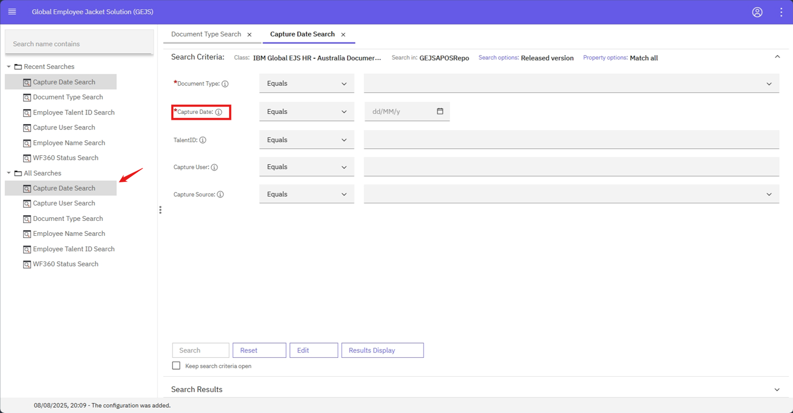

### Mandatory Fields

- In the Search criteria, all the mandatory fields will be displayed with red star mark.
- Each search template will have its own mandatory field(s).
- Mandatory fields should not be empty.
- Search button will be enabled only if the user provides a value in the mandatory field, regardless of values in the other fields.   
- Validations will be different for each field       
- Example: In Capture Date Search template Capture Date property is highlighted with red star mark.
    
  