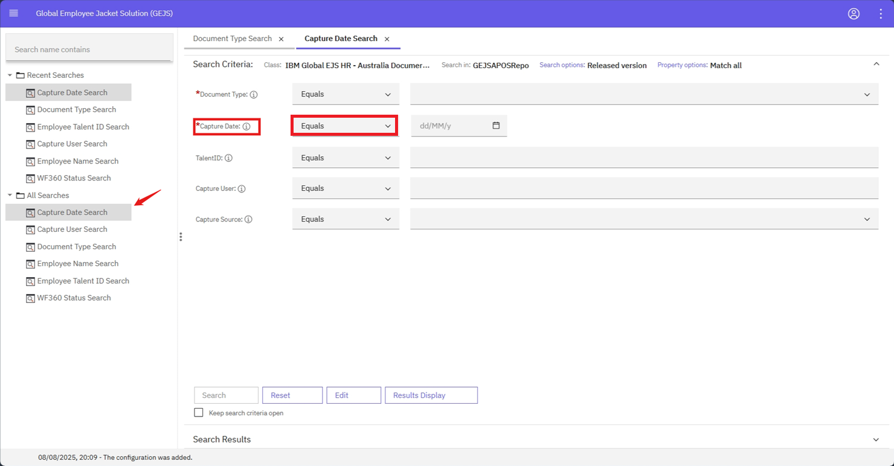

### Operators For Date

- Operators will be visible based on the datatype of the field.
- For date field the operator is: Equals
- Click on “i” icon against field. This provides basic information about the field.

- Example: Capture Date Search is having String and Date Formats, Capture Date is Date format, If user click on the dropdown, they can see operator of the Capture Date property   
   