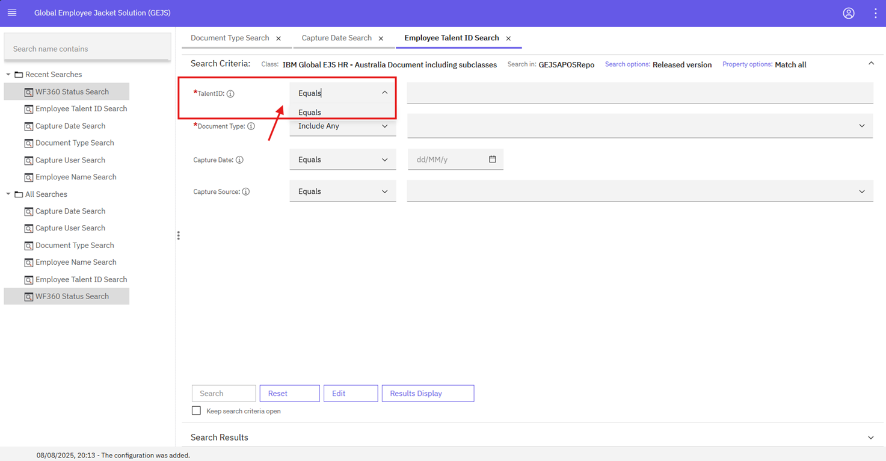

### Operators For String

- Operators on search criteria page will be based on property (Field) markdown
    Please refer each individual search template section for more information
    
- For String, the operators are,
    o Equals

- Click on “i” icon against field. This provides basic information about the field.
- Dropdown to the right of each field name provides the accepted operators for the field.
- TalentID being a string format field has only ‘Equals’ operator, likewise for Document Type, Capture User, Capture Source

   