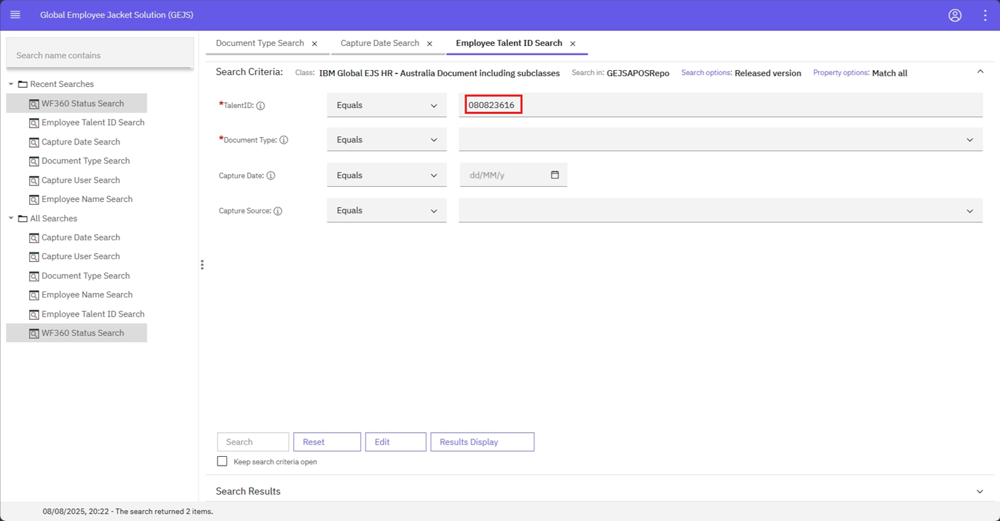
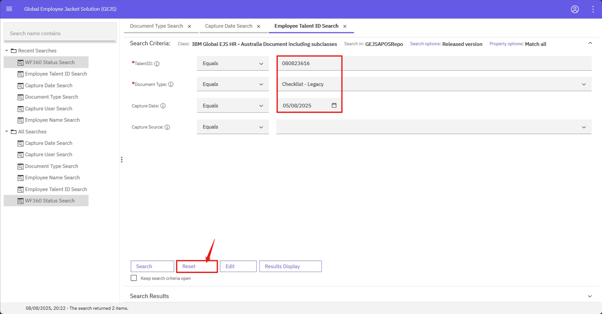
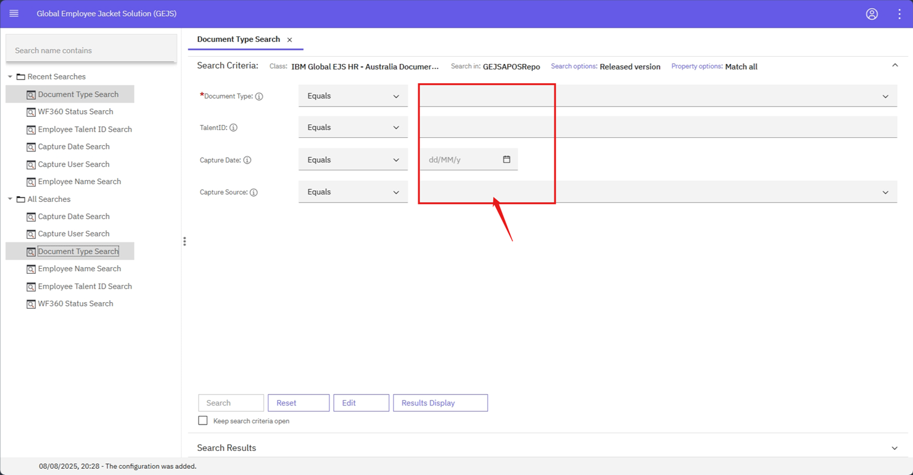

### Search Criteria

- Click on any of the search template.
- Search Criteria page opens for the user to fill the details.
- User can enter the values against each of the field(s) to perform search operation.
- For Example, user can click on Employee Search – Talent ID, and enter 080823616 in TalentID field to search documents belonging to TalentID 080823616.

    

- User can reset the values which are entered on the fields by clicking on Reset button

    

    

