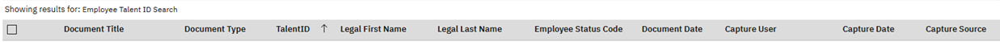
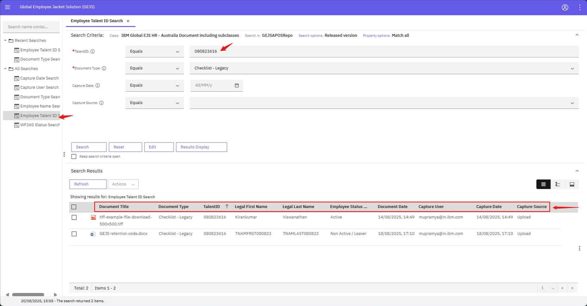
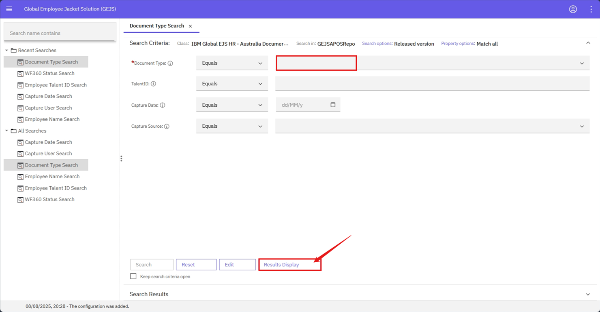

### Search Results

- Enter values for all the mandatory fields in any of the search template.
- Click on search button.
- Based on the provided values, corresponding documents will be displayed on the search results section.
- For all the search templates, the following properties will be displayed on the search results screen.
    
- For each search template by default, the results will be sorted in ascending order based on the mandatory field.

Example:
Entered TalentID value as 080823616. All the documents having CNUM as 080823616 will be displayed on the search results section.
    

**Note:**
User can change the default order of the properties on the search results screen by clicking on the ‘Result Display’ button
    