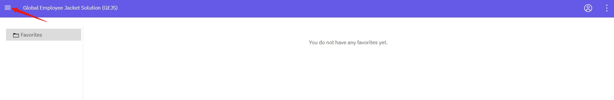
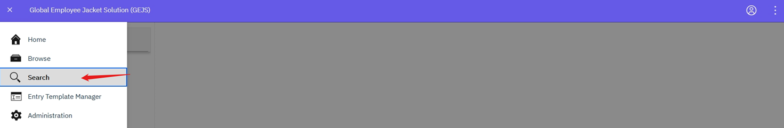
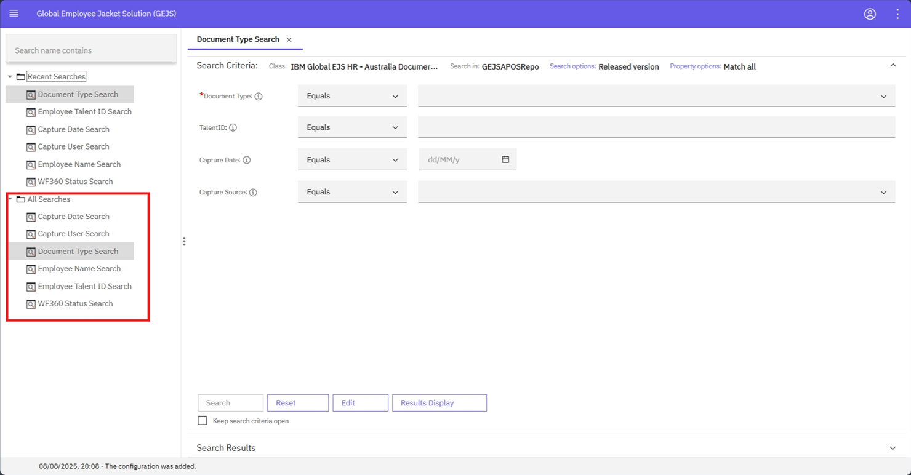

### Document Search Common Functionalities

To perform a document search, follow these steps:
1. **Login to the Application**: For login information, refer to the [User Login](https://pages.github.ibm.com/Global-EJS/GEJS-Australia-EDM-User-Manual/docs/UserLogin.html) section.
2. **Access the Browse Page**: From the Browse page, click the hamburger icon to expand the menu.
    
3. **Navigate to Search Page**: Click on **Search**, and in the Search page, expand the **All-Searches** folder to view the list of search templates.
    
    

By following these steps, you can access the search functionality and begin searching for documents within the system.

For more information on these common functionalities across search, including step-by-step instructions and screenshots, please refer to the Table of Contents and navigate to the relevant section.