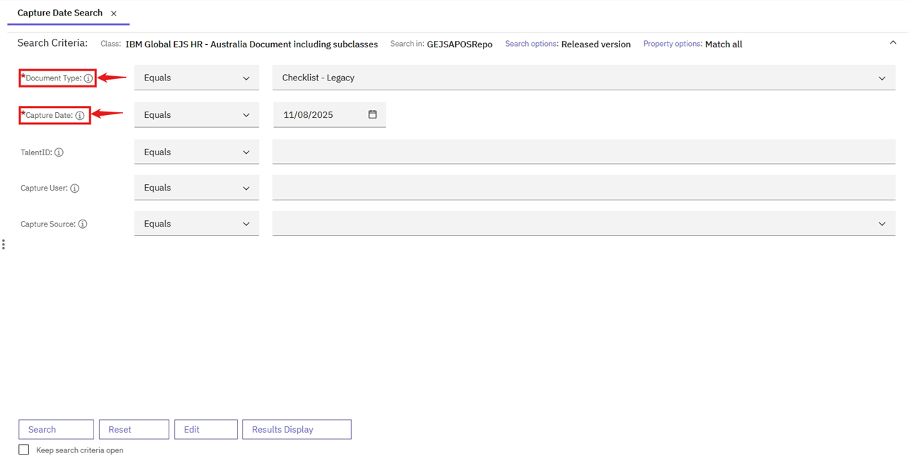

### Capture Date Search
The Capture Date Search feature allows users to search for documents based on the date they were uploaded.

Steps to Perform Capture Date Search:

Log in to the system and navigate to the Browse page. Refer to the [User Login](https://pages.github.ibm.com/Global-EJS/GEJS-Australia-EDM-User-Manual/docs/UserLogin.html) section for login information. Click the hamburger icon to expand the menu and select Search. Expand the All Searches or Recent Searches section and click on Capture Date.

**Search Criteria:**

The following fields are available in the search criteria section:
   
   |Property to Search For |Operator |Mandatory|Dropdown (ChoiceList) |Property Length |
   --- | --- | ---|
   |DocumentType|Equals|Yes|Yes|50|
   |Capture Date|Equals|Yes|||
   |TalentID|Equals|||10|
   |Capture User|Equals||Yes|250|
   |Capture Source|Equals||Yes|12|

1. Mandatory Fields:
    - Mandatory fields should not be empty. If a mandatory field is empty, the Search button will be disabled.
    
    

2. Operators:
    - String properties (e.g., DocumentType, TalentID, Capture Source, Capture User) have an Equals operator.
    - Date properties (e.g., Capture Date) have Equals operator.

3. Search Button:
    - After filling all the mandatory fields, click on the Search button.
    - The search results section will be loaded with matched documents based on the values entered by the user.
    

**Search Results:**

- Users can view all the information on the document in the Search Results page.
- Refer to the Search Results section for the list of document properties that will be visible to the user on the search results section.

- If you wish to download the document properties and values, use the Export Properties Report feature.
- Refer [Search Results](https://pages.github.ibm.com/Global-EJS/GEJS-Australia-EDM-User-Manual/docs/DocumentSearch/CommonFunctionalities/SearchResults.html), [Export Properties Report](https://pages.github.ibm.com/Global-EJS/GEJS-Australia-EDM-User-Manual/docs/Actions/Export.html) for more details.