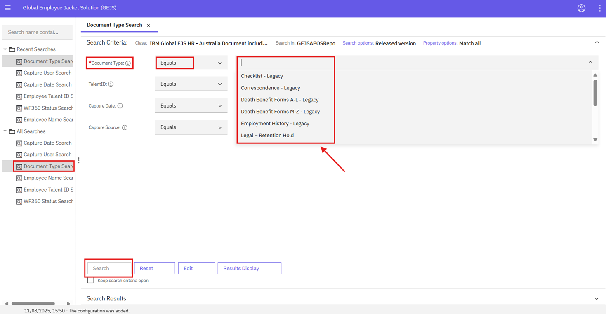
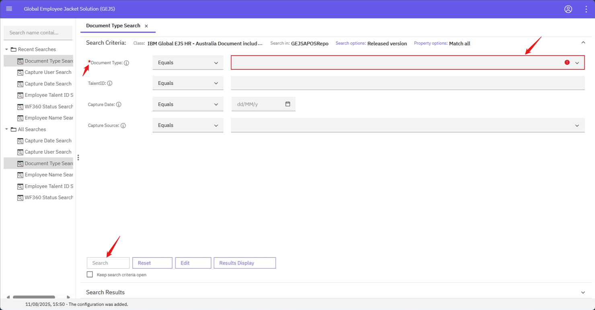
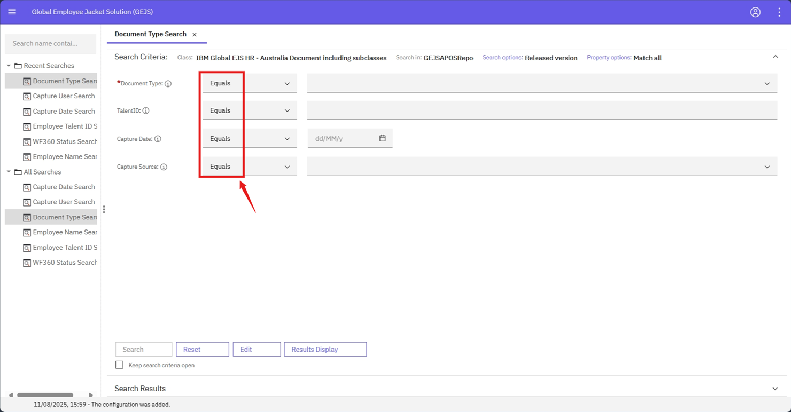
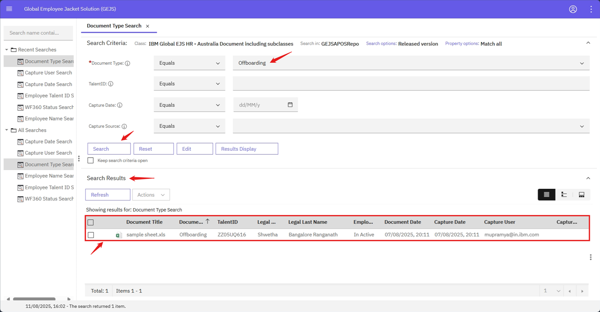

### Document Type Search
The Document Type Search feature allows users to search for documents in the repository based on their type.

Steps to Perform Document Type Search:
- Log in to the system and navigate to the Browse page. Refer to the [User Login](https://pages.github.ibm.com/Global-EJS/GEJS-Australia-EDM-User-Manual/docs/UserLogin.html) section for login information.
- Click the hamburger icon to expand the menu and select Search.
- Expand the All Searches or Recent Searches section and select Document Type Search.

**Search Criteria:**
The following fields are available in the search criteria section:
    

   |Property to Search For |Operator |Mandatory|Dropdown (ChoiceList) |Property Length |
   --- | --- | ---|
   |DocumentType|Equals|Yes||50|
   |TalentID|Equals|||10|
   |Capture Date|Equals||||
   |Capture Source|Equals|Yes||12|

1. Mandatory Fields:
    - Mandatory fields should not be empty. If a mandatory field is empty, the Search button will be disabled.
    

2. Operators:
    - String properties (e.g., Capture Source, TalentID, DocumentType) have an Equals operator.
    - Date properties (e.g., Capture Date) have Equals operator.
    

3. Search Button:
    - After filling all the mandatory fields, click on the Search button.
    - The search results section will be loaded with documents based on the values entered by the user.
    

**Search Results:**
- Users can view all the information about the document in the Search Results page.
- Refer to the [Search Results](https://pages.github.ibm.com/Global-EJS/GEJS-Australia-EDM-User-Manual/docs/DocumentSearch/CommonFunctionalities/SearchResults.html) section for the list of document properties that will be visible to the user on the search results section.
- If you wish to download the document properties and values, use the [Export Properties Report](https://pages.github.ibm.com/Global-EJS/GEJS-Australia-EDM-User-Manual/docs/Actions/Export.html) feature.

By using the Document Type Search feature, users can quickly and easily find documents based on their type, making it easier to manage and track documents within the system.