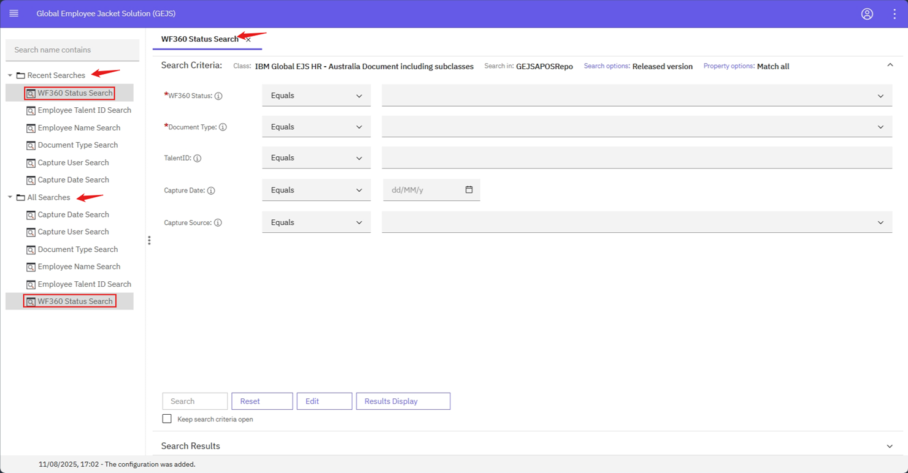
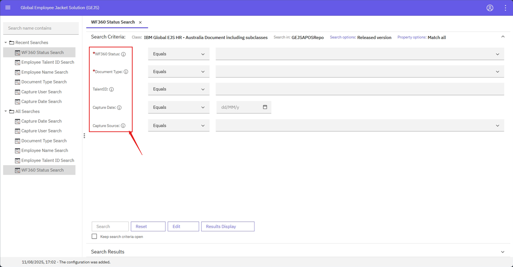
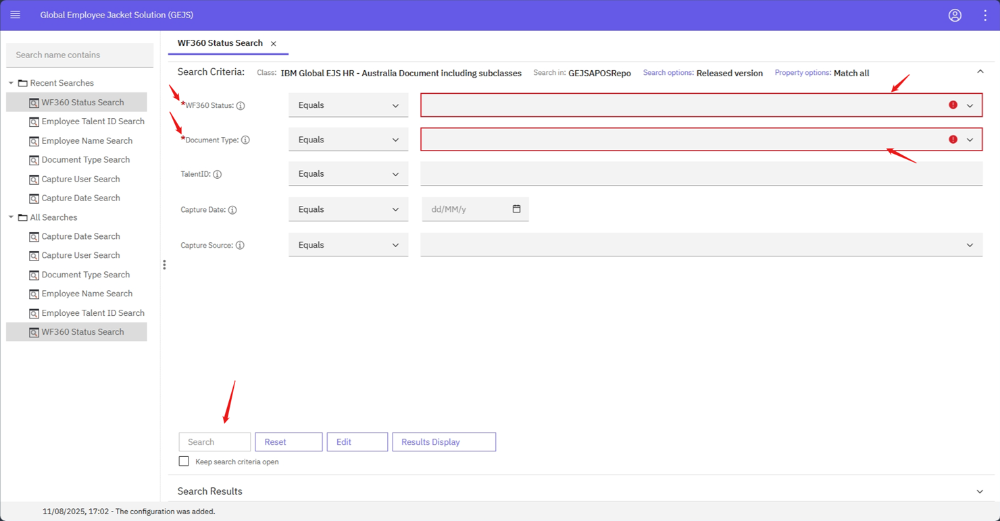
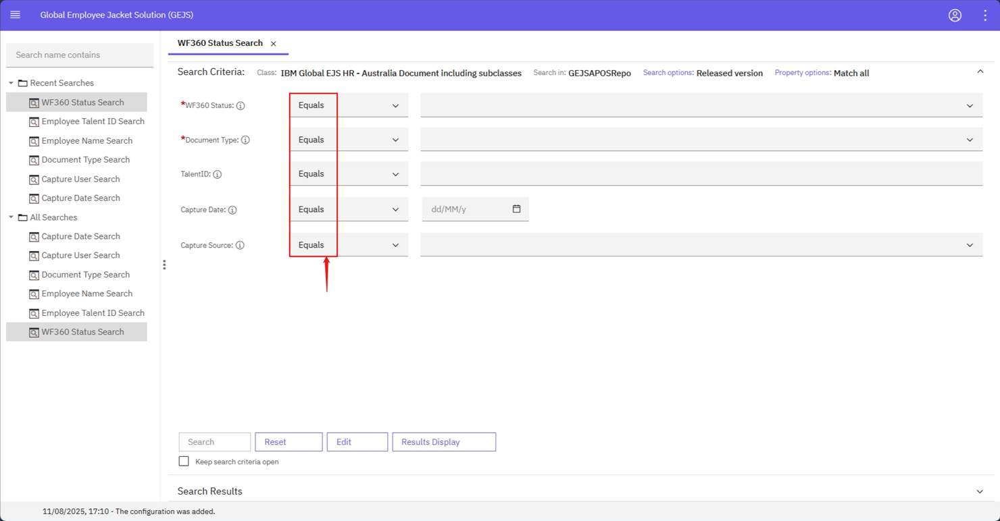
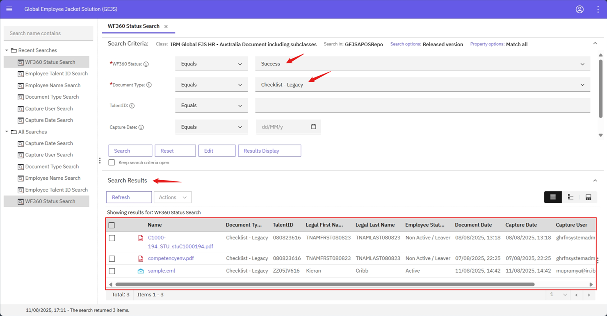

### WF360 Status Search based on Documents WF360 Status
The WF360 Status Search feature allows users to search for documents in the repository based on their WF360 status.

**Steps to Perform WF360 Status Search:**

1. Log in to the system and navigate to the Browse page. Refer to the [User Login](https://pages.github.ibm.com/Global-EJS/GEJS-Australia-EDM-User-Manual/docs/UserLogin.html) section for login information.
2. Click the hamburger icon to expand the menu and select **Search**.
3. Expand the **All Searches** or **Recent Searches** section and select **WF360 Status Search**.

**Search Criteria:**

The following fields are available in the search criteria section:

| Property to Search For | Operator | Mandatory | Dropdown (ChoiceList) | Property Length |
| --- | --- | --- | --- | --- |
| WF360Status | Equals | Yes |  | 150 |
| DocumentType | Equals | Yes |  | 50 |
| Talent ID | Equals |  |  | 150 |
| Capture Date | Equals, Between |  |  |  |
| Capture Source | Equals |  |  | 12 |

**Mandatory Fields:**

* Mandatory fields should not be empty. If a mandatory field is empty, the **Search** button will be disabled.

**Operators:**

* String properties (e.g., DocumentType, Capture Source, WF360Status, Talent ID) have an **Equals** operator.
* Date properties (e.g., Capture Date) have **Equals** operator.

**Search Button:**

* After filling all the mandatory fields, click on the **Search** button.
* The search results section will be loaded with documents based on the values entered by the user.

**Search Results:**

* Users can view all the information about the document in the **Search Results** page.
* Refer to the [Search Results](https://pages.github.ibm.com/Global-EJS/GEJS-Australia-EDM-User-Manual/docs/DocumentSearch/CommonFunctionalities/SearchResults.html) section for the list of document properties that will be visible to the user on the search results section.
* If you wish to download the document properties and values, use the [Export Properties Report](https://pages.github.ibm.com/Global-EJS/GEJS-Australia-EDM-User-Manual/docs/Actions/Export.html) feature.

By using the WF360 Status Search feature, users can quickly and easily find documents based on their WF360 status, making it easier to manage and track documents within the system.