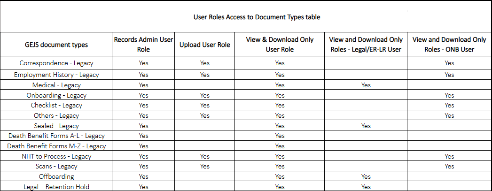

### 
Document Type View Restrictions (From Search Templates)

{: .no_toc }

## Table of contents
{: .no_toc .text-delta }

1. TOC
{:toc}

---
### User Role Matrix

### Records Admin User & View User Restrictions
The access restrictions for Records Admin User and View User are as follows:

#### Records Admin User:

* Can view all document types from search templates
* Can upload documents using the Upload Documents entry template
* Has full access to all document types for viewing and uploading purposes

#### View User:

* Can view all document types from search templates
* Cannot upload documents
* Has read-only access to all document types for viewing purposes only

In summary, the Records Admin User has full access to view and upload all document types, while the View User has read-only access to view all document types, but cannot upload documents.

### View Only - Onboarding User Restrictions
The View Only - Onboarding user has limited access and is restricted to viewing only the following document types:

    Correspondence - Legacy
    Employment History - Legacy
    Onboadring - Legacy
    Checklist - Legacy
    Others - Legacy
    NHT to Process - Legacy
    Scans - Legacy

The user will not be able to:

* View any other document types outside of the above list
* Edit or modify any documents
* Upload or delete documents

The View Only - ERLR user role is designed to provide read-only access to specific document types, ensuring that sensitive information is protected and only accessible to authorized users.

### View Only - ERLR User Restrictions
The View Only - ERLR user has limited access and is restricted to viewing only the following document types:

    Medical - Legacy
    Sealed - Legacy
    Offboarding
    Legal - Retention Hold

The user will not be able to:

* View any other document types outside of the above list
* Edit or modify any documents
* Upload or delete documents

The View Only - ERLR user role is designed to provide read-only access to specific document types, ensuring that sensitive information is protected and only accessible to authorized users.

### Upload User Restrictions
The Upload user has limited access and is restricted to uploading documents only. Additionally, the user is only allowed to upload specific document types, which are:

    Correspondence - Legacy
    Employment History - Legacy
    Onboadring - Legacy
    Checklist - Legacy
    Others - Legacy
    NHT to Process - Legacy
    Scans - Legacy

As a result, the Upload user will not be able to:

* View any document types from search templates
* Upload documents outside of the allowed document types

These restrictions are in place to ensure that the Upload user can only perform their designated tasks and do not have access to sensitive or unauthorized information.