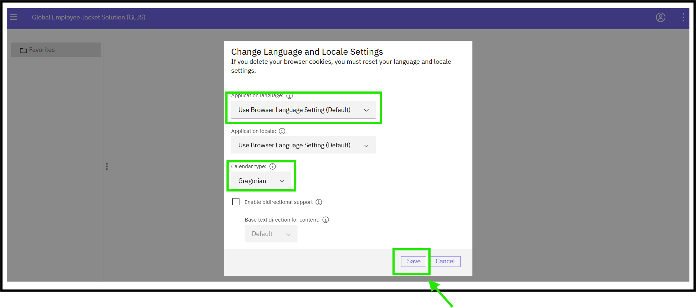

## Language and Local Settings

1. User can view the language and local browser settings by clicking on the required button as shown in below

2. By default, Global EJS Australia EDM application language will be based on the region of the user.  
3. To change Global EJS Australia EDM application language, select the preferred language in Application Language and Application locale and then click on save button.
