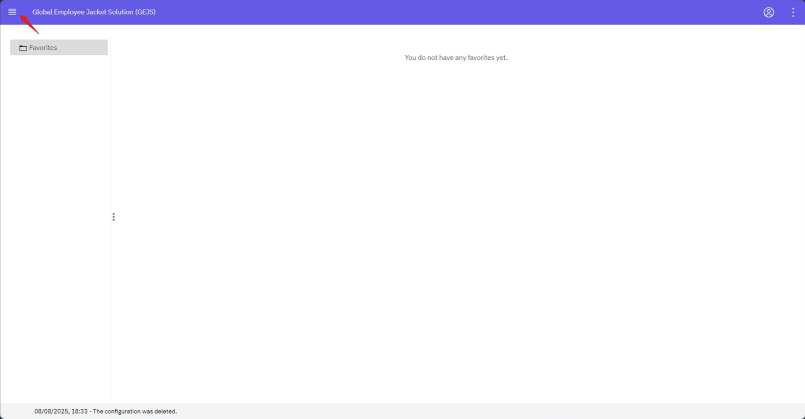
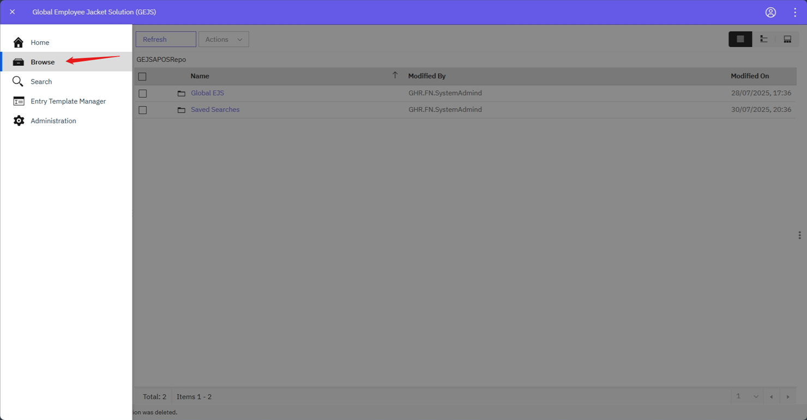
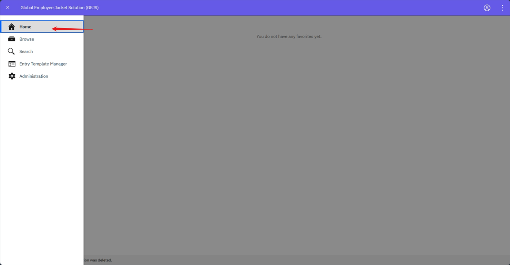
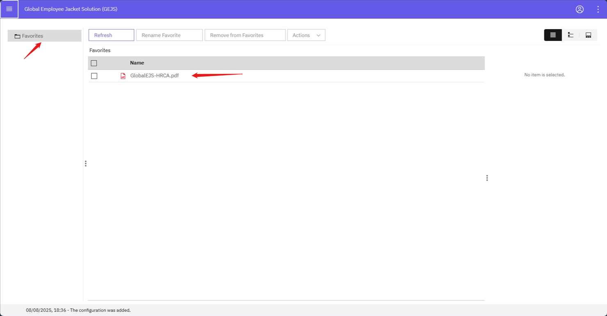
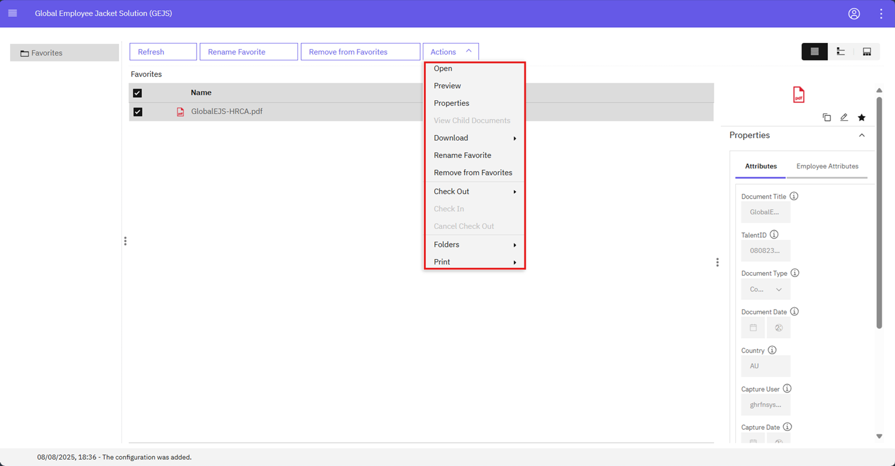
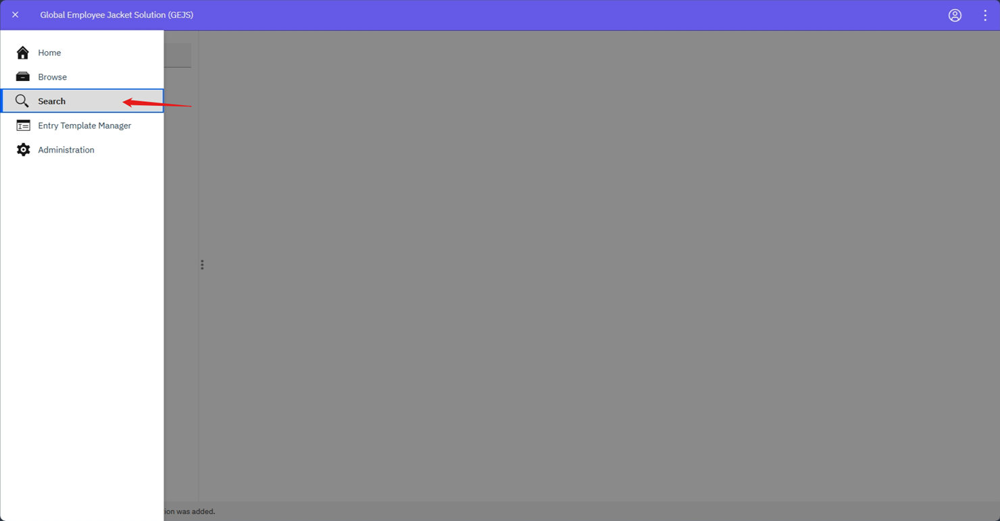

## Layouts
{: .no_toc }

## Table of contents
{: .no_toc .text-delta }

1. TOC
{:toc}

---

- Once user logs into ‘Global EJS Australia EDM’ Application, it will land on ‘Browse’ Page by default.
   
- At the left top most corner four bars are visible. Click on icon to expand the ‘hamburger’ menu to view the Home, Browse, Search, Datacap Main Page tabs.
   

- Users can click on icons which are specified below as per the need
   

### Home
1. Click on ‘Home’ Icon
   

2. User navigates to Favorites Screen
   

3. Please refer [Add to Favorites](https://pages.github.ibm.com/Global-EJS/GEJS-Australia-EDM-User-Manual/docs/Actions/Favuorites.html) section to add documents and folders to Favorites

    **Note:** The Documents and Folders which are added to Favorites will only be visible to the current logged in user, these will not be visible to any other user.

### Browse
1. Browse is the default page loaded when the user logs into the application.
2. From the Browse page, the folders can be expanded to view the folders and any documents added to the folders.  
3. From the Browse page, user can perform Actions on documents.  Please refer to [Actions](https://pages.github.ibm.com/Global-EJS/GEJS-Australia-EDM-User-Manual/docs/Actions/) section.
    

### Search
From the expanded menu, click on the Search to access the predefined set of Search templates. Please refer to the [Document Search](https://pages.github.ibm.com/Global-EJS/GEJS-Australia-EDM-User-Manual/docs/DocumentSearch/DocumentSearch.html) section
    