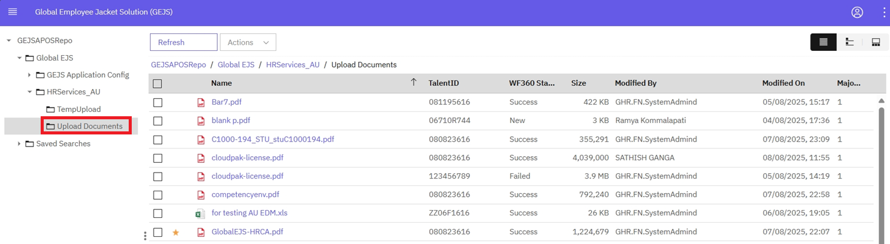

## View
{: .no_toc }

## Table of contents
{: .no_toc .text-delta }

1. TOC
{:toc}

---
Once user logs into ‘Global EJS Australia EDM’ Application, it will land on ‘Browse’ Page by default.

  

User can change the view of the folders and documents by clicking the view buttons on the top right corner.

### Details View

By default, ‘Details View’ will display once user logs into application

   

### Magazine View

User can change view of the documents and folders to Magazine view by clicking on below specified Icon

  

### Filmstrip View

- User can change view of the documents and folders to Filmstrip View by clicking on below specified Icon

  

- 1. Open the folder under GEJSINEDMRepo -> Global EJS -> HRServices_IN -> Upload Documents

  
  
- Click on Filmstrip View, upon clicking the User Interface will be shown as below,

   

- Click on any of the document(s), the content of the document will be loaded as shown below,
  
  
 
- Features available in Document Viewer

  
  

**Note:** View features will not display for some file types in in Filmstrip view.