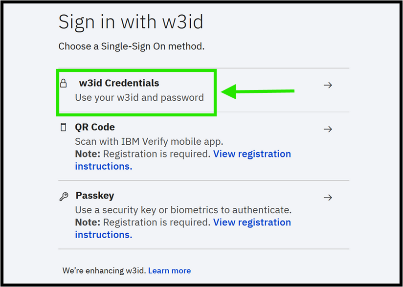
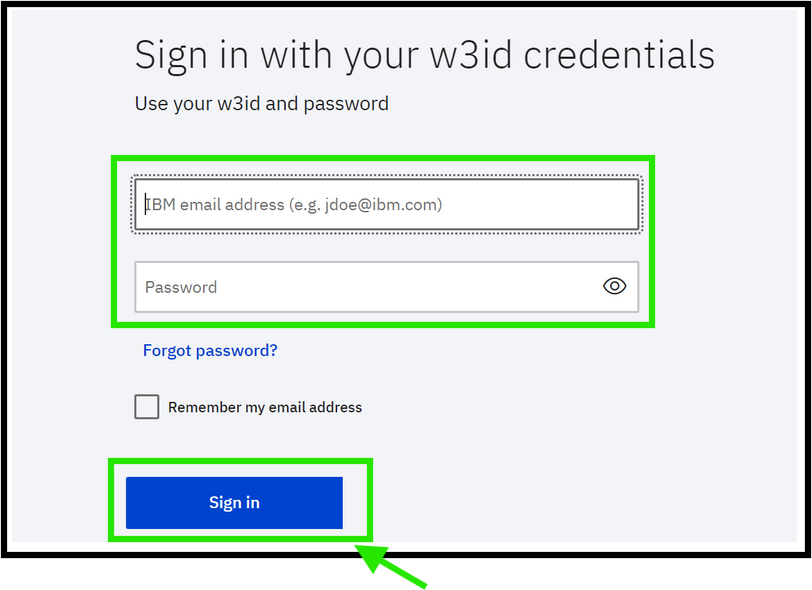
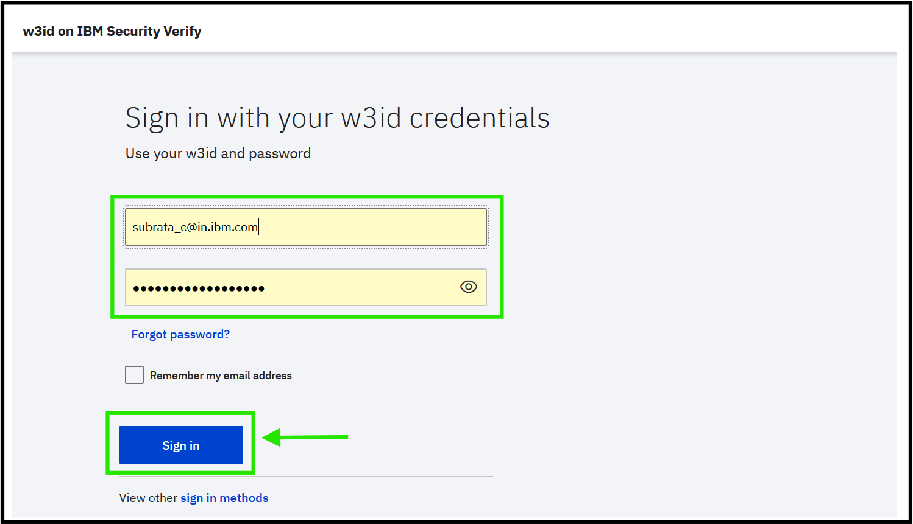

## User Login

1. User must log in to Global EJS - Australia EDM Application using secure credentials to perform functionalities such as document upload and document search.

2. Login to Global EJS - Australia EDM Desktop using below URL:

    **UAT URL** : [Global EJS - Australia EDM Application](https://cpd-gejscp4ba-dev.ibmejsdemo21-a77d60340023a6bc6f520169685a0756-0000.us-south.containers.appdomain.cloud/icn/navigator/?desktop=GEJSAPAU){:target="_blank" rel="noopener"}

    	
    **PROD URL**: [Global EJS - Australia EDM Application](https://cpd-gejs-prod-cp4ba.glbmzcl20221-a77d60340023a6bc6f520169685a0756-0000.us-south.containers.appdomain.cloud/icn/navigator/?desktop=GEJSAPAU){:target="_blank" rel="noopener"}  
		  
3. Login page loads for the user to enter the credentials. 

	

4. Global EJS - Australia EDM Application is integrated with IBM W3. User will enter IBM W3 credentials to login to the application.

	

5. If the User is already logged into any of the IBM application using W3 credentials, user lands on Browse page as soon as the above URL is loaded from the browser.

6. Login with username and password (IBM w3id and password).
	

**Note:** If a user is unable to login, user should clear cache of the browser.